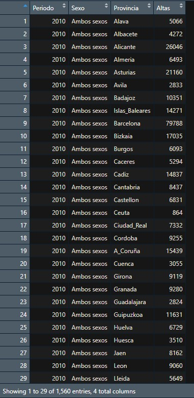
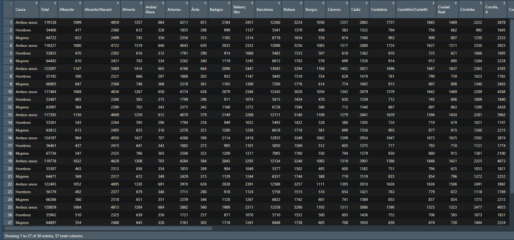
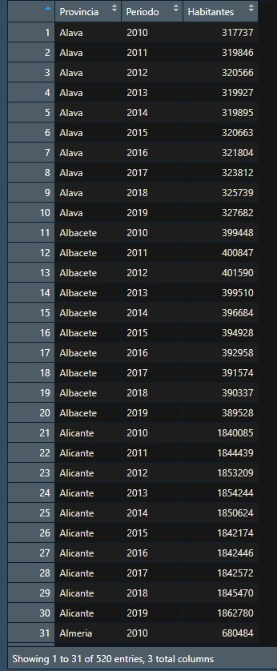
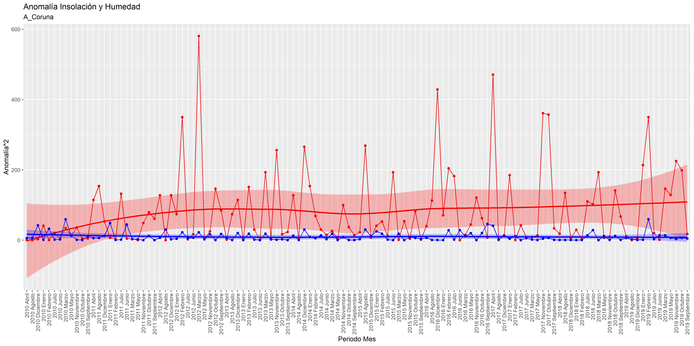
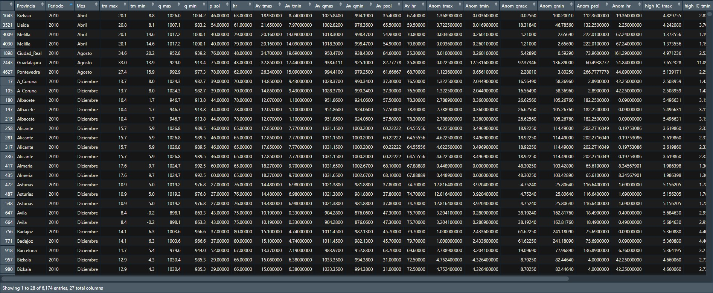

```{r setup, include=FALSE}
knitr::opts_chunk$set(echo = TRUE)
```

### {data-background=https://vinilosametros.com/wp-content/uploads/2018/04/color-azul-claro-2-510x509.jpg data-background-size=cover}
<center>
<font size="30">
<span style="color:black">
**INTRODUCCIÓN**

{width=600px}
</span>
</font>
</center>

###
<span style="color:black">
<center>
<font size="6">

**¿POR QUÉ ESTE TEMA?**

</font>
</center> 

<div style="text-align: justify"> 

El proyecto realizado estudia la posible relación e influencia del cambio climático sobre la incidencia y mortalidad de enfermedades cardiovasculares.

Se ha escogido este tema debido a que estamos ante los datos más extremos de concentraciones de gases de efecto invernadero de la historia, aumentando el calor terrestre, por lo que podría desencadenar el aumento de riesgo de muerte para aquellas personas que padecen enfermedades cardiovasculares.

</div>
</span>
<center>
{width=200px}
</center>

###
<span style="color:black">
<center>
<font size="6">

**CAMBIO CLIMÁTICO**

</font>
</center>

<div style="text-align: justify"> 

<span style="color:gray">
_¿Qué es?_
</span>

Los cambios a largo plazo de las temperaturas y los patrones climáticos como consecuencia de causas naturales y sobre todo humanas, como la quema de combustibles fósiles.


Esta quema de combustibles genera la emisión de gases de efecto invernadero que actúan elevando la temperatura terrestre. La mayor parte de estos gases está compuesta por dióxido de carbono y de metano.

</div>
</span>
<center>

{width=300px}
## 
<span style="color:black">
<center>
<font size="6">


</font>
</center>

<div style="text-align: justify"> 

<span style="color:gray">
_Causas_
</span>

- Naturales
  - Cambios de parámetros orbitales
  - Variaciones de la radiación solar
  - Deriva continental
  - Procesos bióticos
  - ...
  

</div>
</span>
<center>

{width=370px}
</center>

## 
<span style="color:black">
<center>
<font size="6">


</font>
</center>

<div style="text-align: justify"> 

<span style="color:gray">

</span>

- Humanas
  - Quema de combustibles fósiles
  - Transporte
  - Deforestación
  - Ganadería
  - ...

</div>
</span>
<center> 
  
{width=300px}            {width=310px}
</center> 


##
<span style="color:black">
<center>
<font size="6">

</font>
</center>

<div style="text-align: justify"> 

<span style="color:gray">

_Consecuencias_
</span>

- Deshielo y aumento del nivel del mar. 
- Condiciones metereológicas extremas que provocan inundaciones y deterioro de la calidad del agua.
- Olas de calor y sequías.
- Pérdidas económicas.
- Extinción y desplazamiento de especies a otros hábitats. 
- Aumenta el riesgo de muerte como consecuencia de temperaturas elevadas.

</div>
</span>

<center>
{width=350px}
</center>


###
<span style="color:black">
<center>
<font size="6">

**ENFERMEDADES CARDIOVASCULARES**

</font>
</center>

<div style="text-align: justify"> 

<span style="color:gray">
_¿Qué son?_
</span>

Son aquellas relacionadas con el corazón o vasos sanguíneos. Se incluyen transtornos de los vasos sanguíneos, problemas en el ritmo cardíaco, defectos cardíacos, infecciones de corazón...

Este tipo de transtornos **causan el mayor número de muertes** en el mundo (según la [OMS](https://www.who.int/es/news-room/fact-sheets/detail/the-top-10-causes-of-death))

</div>
</span>

<center>
{width=350px}
</center>


##
<span style="color:black">
<center>
<font size="6">


</font>
</center>

<div style="text-align: justify"> 

<span style="color:gray">
_Síntomas_
</span>

- Dolor en el pecho. 
- Falta de aire. 
- Taquicardia o bradicardia
- Aturdimiento
- Mareos
- Fatiga

</div>
</span>

<center>
{width=300px}
</center>


##
<span style="color:black">
<center>
<font size="6">


</font>
</center>

<div style="text-align: justify"> 

<span style="color:gray">

_Causas_
</span>

- Infecciones
- Tabaquismo
- Hábitos de vida insanos
- Diabetes
- Abuso de drogas o bebidas alcohólicas
- Enfermedades congénitas

</div>
</span>

<center>
{width=350}
</center>

###
<span style="color:black">
<center>
<font size="6">


**RELACIÓN ENTRE AMBOS CONCEPTOS**

</font>
</center>

<div style="text-align: justify"> 

El aumento de la temperatura, el estrés ambiental y las variaciones en la presión atmosférica pueden afectar a factores fisiológicos como la presión arterial o la temperatura corporal. 

De igual manera el descenso de la temperatura puede influir en la viscosidad sanguínea y la frecuencia cardíaca. 

Por ello, cambios extremos e inusuales en los factores ambientales pudieran estar relacionados con un aumento de la incidencia y mortalidad de las ECV.

<center>
{width=300px}
</center>

</div>
</span>

##
<span style="color:black">
<center>
<font size="6">


</font>
</center>

<span style="color:gray">
_Otros estudios_
</span>

<div style="text-align: justify"> 

[1] [Peters, A., Schneider, A. Cardiovascular risks of climate change. Nature Reviews Cardiology 18, 1–2 (2021).](https://rdcu.be/cAYF8)

[2] [De Blois J, Kjellstrom T, Agewall S, Ezekowitz J, A, Armstrong P, W, Atar D: The Effects of Climate Change on Cardiac Health. Cardiology 2015](https://doi.org/10.1159/000398787)

[3] [Cheng X, Su H. Effects of climatic temperature stress on cardiovascular diseases. European Journal of Internal Medicine. 2010 Jun](https://doi.org/10.1016/j.ejim.2010.03.001)

[4] [Wang X, Cao Y, Hong D, Zheng D, Richtering S, Anderson C, Robinson T, Hackett ML. Ambient Temperature and Stroke Occurrence: A Systematic Review and Meta-Analysis. Int J Environ Res Public Health. 2016 Jul 12](https://doi.org/10.3390/ijerph13070698)

</div>
</span>

### {data-background=https://vinilosametros.com/wp-content/uploads/2018/04/color-azul-claro-2-510x509.jpg data-background-size=cover}
<center>
<font size="30">
<span style="color:black">

**OBJETIVOS**


</span>
</font>
</center>

####
<span style="color:black">
<center>
<font size="6">

**OBJETIVO GENERAL**

</font>
</center>

<div style="text-align: justify"> 

Tratar de encontrar correlación entre el cambio climático y una mayor incidencia y mortalidad de las enfermedades cardiovasculares en España en entre los años 2010 y 2019.

</div>
</span>


####
<span style="color:black">
<center>
<font size="6">

**OBJETIVO ESPECÍFICO 1**

</font>
</center>

<div style="text-align: justify"> 

Estudiar las variables meteorológicas mensuales (temperatura, presión atmosférica e insolación diaria) de todas las provincias españolas desde 2010 hasta 2019, con el fin de determinar qué meses y provincias fueron los más adversos.

</div>
</span>


####
<span style="color:black">
<center>
<font size="6">

**OBJETIVO ESPECÍFICO 2**

</font>
</center>

<div style="text-align: justify"> 

Una vez conocidas las provincias con climatología más adversa para cada año del periodo 2010-2019, comprobar si la morbilidad hospitalaria y la mortalidad por ECV fue significativamente mayor en dichas provincias con respecto a las climatológicamente normales.

</div>
</span>

####
<span style="color:black">
<center>
<font size="6">

**OBJETIVO ESPECÍFICO 3**

</font>
</center>

<div style="text-align: justify"> 

Una vez conocidos qué meses y de qué año tuvieron una climatología más extrema en todo el territorio nacional, comprobar si la mortalidad por ECV fue significaticamente mayor esos meses en comparación con los demás meses.

</div>
</span>


### {data-background=https://vinilosametros.com/wp-content/uploads/2018/04/color-azul-claro-2-510x509.jpg data-background-size=cover}
<center>
<font size="30">
<span style="color:black">

**METODOLOGÍAS**


</span>
</font>
</center>

## 
<span style="color:black">
<center>
<font size="6">

</font>
</center>

<span style="color:gray">
_Objetivo 1_
</span>

<div style="text-align: justify"> 

- Crear un archivo .csv que contenga las URL a los archivos con la información meterológica mensual por provincias desde 2010 hasta 2019.

- Crear los archivos correspondientes a cada provincia empleando R, obteniendo 52 dataframes (uno por provincia) que contengan toda la información meteorológica desde 2010 a 2019.
</div>
</span>

<center>

</center>

## 
<span style="color:black">
<center>
<font size="6">


</font>
</center>

<span style="color:gray">

</span>

<div style="text-align: justify"> 

- Filtrar cada dataframe para que únicamente contenga la información de cada año y mes referente a: temperatura media, temperatura media de las máximas, temperatura media de las mínimas, presión media, presión máxima absoluta, presión mínima absoluta, media de insolación y porcentaje medio mensual de la insolación diaria frente a la insolación teórica.

</div>
</span>

## 
<span style="color:black">
<center>
<font size="6">


</font>
</center>

<span style="color:gray">

</span>

<div style="text-align: justify"> 

- Comparar las variables meteorológicas de una misma provincia entre los diferentes meses y años y seleccionar los valores más extremos para cada variable meteorológica, almacenando en un vector aquellos meses y años con más de 2 factores extremos. Repetir dicho proceso con todas las provincias, de manera que se obtengan 52 vectores (como máximo) que contengan los meses más adversos correspondientes a cada provincia.

</div>
</span>

<center>
{width=300px}
</center>

## 
<span style="color:black">
<center>
<font size="6">

</font>
</center>

<span style="color:gray">
_Objetivo 2_
</span>

<div style="text-align: justify"> 

- Descargar todos los archivos en formato .json que contienen la información relativa a morbilidad hospitalaria y causas de defunción desde 2010 a 2019 a través de la página INEBase.

- Combinar dichos archivos mediante R para obtener 52 dataframes (uno por provincia) que contenga toda la información referente a la morbilidad hospitalaria y causas de defunción anual desde 2010 a 2019.

</div>
</span>

<center>
{width=300px}
</center>


## 
<span style="color:black">
<center>
<font size="6">


</font>
</center>

<span style="color:gray">

</span>

<div style="text-align: justify"> 

- Filtrar los dataframes para que únicamente contengan la información referente a morbilidad hospitalaria por Enfermedades del aparato circulatorio (I00-I99) y causas de defunción debido a Enfermedades del sistema circulatorio (053-061) clasificado por provincias y año.

- Comprobar si hay alguna provincia que posea 3 meses en un mismo año con meteorología adversa, y contrastar la mortalidad y morbilidad hospitalaria para ECV en esa provincia y ese año con los datos normales.

</div>
</span>

## 
<span style="color:black">
<center>
<font size="6">


</font>
</center>

<span style="color:gray">
_Objetivo 3_
</span>

<div style="text-align: justify"> 

- Combinar los archivos de causas de defunción mensual a nivel nacional obteniendo 10 dataframes (uno por año desde 2010 a 2019).

- Filtrar dichos dataframes para que únicamente contengan la información referente al número de muertes por Enfermedades del sistema circulatorio (053-061) en cada mes de dicho año.

</div>
</span>

<center>
{width=300px}
</center>
## 
<span style="color:black">
<center>
<font size="6">


</font>
</center>

<span style="color:gray">

</span>

<div style="text-align: justify"> 

- Comprobar si hay algún mes de algún año que aparezca como adverso en más de 20 provincias, y contrastar la mortalidad por Enfermedades del sistema circulatorio en ese mes con el resto de datos normales.

- Graficar los resultados obtenidos en todos los análisis.

</div>
</span>

<center>
{width=400px}
</center>


### {data-background=https://vinilosametros.com/wp-content/uploads/2018/04/color-azul-claro-2-510x509.jpg data-background-size=cover}
<center>
<font size="30">
<span style="color:black">

**DESARROLLO DEL PROYECTO**

</font>
</center> 

<div style="text-align: justify"> 
#### **1. Carga de los datos**

En el proyecto desarrollado se va a tratar de vincular el cambio climático con las enfermedades cardiovasculares, para ello se emplean 5 fuentes de datos distintas:

-	Datos meteorológicos mensuales a nivel provincial
-	Datos anuales de morbilidad a nivel provincial 
-	Datos anuales de mortalidad a nivel provincial
-	Datos mensuales de mortalidad a nivel nacional
-	Datos anuales de número de población a nivel provincial

Se va a explicar desde qué fuente y cómo se obtuvieron cada uno de ellos.

#### _1.1. Datos metereológicos_

En un principio se obtuvieron desde la plataforma de Open Data del AEMET, generando para ello un fichero .csv con todos los enlaces a cada conjunto de datos:

</div>
</span>

<center>
<figure>

<figcaption>Aspecto del archivo csv </figcaption>
</figure>

<br>
      
<div style="text-align: justify">

  
Sin embargo surgió uno de los primeros problemas: los enlaces empleados tenían una cierta caducidad y no eran válidos trascurridos 5 días. Por ello nos vimos obligados a cambiar la forma de acceder a dichos datos. Se descubrió un paquete de R denominado _climaemet_ que incorpora varias funciones, permitiendo acceder de forma directa a los datos meteorológicos desde R.

Para ello se empleó la función _climaemet::aemet_monthly_period(station, start, end)_ que permite acceder a los datos mensuales de cada provincia, pasando como parámetro station el nombre de la estación climatológica de interés y como parámetros start y end los años de inicio y fin de la búsqueda.

El objetivo era crear 52 dataframes, uno para cada provincia. El nombre de estos dataframes esta compuesto por el nombre de la provincia + la palabra ‘Meteo’. Para emplear un formato estándar de nombres de provincias se declararon 2 vectores:

```{r eval=FALSE}
Provincias <- c("Alava","Albacete","Alicante","Almeria","Asturias","Avila","Badajoz","Islas_Baleares","Barcelona","Bizkaia","Burgos","Caceres","Cadiz","Cantabria","Castellon","Ceuta","Ciudad_Real","Cordoba","A_Coruna","Cuenca","Girona","Granada","Guadalajara","Guipuzkoa","Huelva","Huesca","Jaen","Leon","Lleida","Lugo","Madrid","Malaga","Melilla","Murcia","Navarra","Ourense","Palencia","Las_Palmas","Pontevedra","La_Rioja","Salamanca","Tenerife","Segovia","Sevilla","Soria","Tarragona","Teruel","Toledo","Valencia","Valladolid","Zamora","Zaragoza")

Estaciones <- c("9091O","8175","8019","6325O","1212E","2444","4452","B954","0200E","1082","2331","3469A","5960","1109","8500A","5000C","4121","5402","1387","8096","0367","5530E","3168D","1014A","4642E","9898","5270B","2661","9771C","1505","3129","6155A","6000A","7178I","9263D","1690A","2374X","C029O","1495","9170","2867","C447A","2465","5783","2030","9981A","9381I","3260B","8416","2422","2614","9434")
```

De esta manera se crearon los 52 dataframes empleando recursividad:

``` {r eval=FALSE}
for (i in 1:length(Provincias)){
  Nam <- paste(Provincias[i], "Meteo", sep="")
  Objeto <- aemet_monthly_period(station = Estaciones[i], start = 2010, end = 2019)
  assign(Nam, Objeto)
}
```

</div>
</span>

<center>
<figure>

<figcaption>Aspecto del dataframe metereológico recién creado </figcaption>
</figure>

<br>
      
<div style="text-align: justify">

     
Una vez creados estos dataframes, se tuvieron que realizar varias correcciones debido a que ciertas estaciones seleccionadas (la de Guadalajara, Málaga, Palencia, Soria y Valladolid) presentaban años incompletos o de los cuales directamente no existía información (obligándonos a seleccionar otra estación de la misma provincia e introducir la información restante de forma manual).
Un ejemplo de cómo se introdujo esta información:

``` {r eval=FALSE}
MalagaMeteo <- bind_rows(MalagaMeteo, aemet_monthly_clim(station = "6084X", year = 2015)
```

Por último, estos dataframes modificados por falta de datos debieron ser reordenados por fecha para facilitar su posterior trabajo. El problema es que el formato de fecha que presenta AEMET es 2010-1 por ejemplo, por lo que al ordenar por fecha colocaba antes el mes 2010-12 que 2010-2. Por ello se hizo necesario declarar una función que nos permitiera reordenar los dataframes:

``` {r eval=FALSE}
Reorder <- function(provincia){
  #recorre todos los elementos de la columna fecha de la provincia pasada como parámetro
  for (i in 1:length(provincia$fecha)){
    #comprueba si el tamaño del elemento actual de la columna fecha tiene menos de 7 caracteres
    if(nchar(provincia$fecha[i])<7){
      #en caso de que así sea, corta la cadena donde debiera ir el 0, lo introduce y pega la parte de después del 0
      provincia$fecha[i] <- paste(str_sub(provincia$fecha[i], start = 1L, end = 5L), "0", str_sub(provincia$fecha[i], start = -1L, end=-1L), sep = "")
    }
  }
  #por último devuelve la provincia pasada, pero ahora ordenada por fecha (donde ya sí que se puede ordenar correctamente por fecha)
  return(arrange(provincia, fecha))
}

```

Posteriormente aplicaríamos esta función a las provincias modificadas (GuadalajaraMeteo, MalagaMeteo, SoriaMeteo, PalenciaMeteo, ValladolidMeteo).

<br>

#### _1.2 Datos de Morbilidad_
Estos datos se obtuvieron desde la página del INE, en el apartado Salud / Encuesta de morbilidad hospitalaria:


<center>
<figure>

<figcaption>Página del INE donde encontrar datos de morbilidad </figcaption>
</figure>

<br>
      
<div style="text-align: justify">

Desde donde se descargaron los datos en formato .xlsx. Estos archivos de Excel se almacenaron en la carpeta INPUT, y se importaron al archivo .R empleando el siguiente código:

```{r eval=FALSE}
DFMorbilidad <- data.frame()
for (i in dir_ls(path = "INPUT", regexp="morbilidad")){
  temporal <- read_excel(path = i, sheet = "tabla-0", skip = 6, col_types = c("text",rep("numeric",64))) 
  DFMorbilidad <- bind_rows(DFMorbilidad, temporal)
```

Como se puede comprobar se almacenaron en un objeto denominado DFMorbilidad

<div style="text-align: justify">

#### _1.3 Datos de Mortalidad mensual_
También se obtuvieron desde la base de datos del INE, en el apartado INEbase / Salud / Estadística de defunciones según la causa de muerte / Resultados nacionales / Defunciones por causas (lista reducida), sexo y mes de fallecimiento. Un ejemplo de este acceso para el año 2010 es:

<center>
<figure>

<figcaption>Página del INE donde encontrar datos de mortalidad mensual</figcaption>
</figure>

<br>
      
<div style="text-align: justify">
Desde aquí se descargaron los datos en formato .xlsx a la carpeta INPUT. La carga de datos al archivo .R se realizó empleando el siguiente fragmento de código:

```{r eval=FALSE}
DFMort_Mens <- data.frame()
for (i in dir_ls(path = "INPUT", regexp="Mort_nacion")){
  temporal <- read_excel(path = i, sheet = "tabla-0", skip = 6) 
  DFMort_Mens <- bind_rows(DFMort_Mens, temporal)
}
```

Donde podemos comprobar que se almacenaron en un objeto denominado DFMort_Mens.

<div style="text-align: justify">

#### _1.4 Datos de mortalidad provincial_

De nuevo acudimos al INE, al apartado INEbase / Salud / Estadística de defunciones según la causa de muerte / Resultados por provincia de residencia/ Defunciones por causas (lista reducida) por sexo. Ejemplo de ello:

<center>
<figure>

<figcaption>Página del INE donde encontrar datos de mortalidad provincial </figcaption>
</figure>

<br>
      
<div style="text-align: justify">
     
Donde se descargaron los archivos en formato .xlsx en la carpeta INPUT. Desde ahí se cargaron de nuevo al fichero. R mediante el siguiente código:
``` {r eval=FALSE}
DFMort_Prov <- data.frame()
for (i in dir_ls(path = "INPUT", regexp="mort_prov")){
  temporal <- read_excel(path = i, sheet = "tabla-0", skip = 6) 
  DFMort_Prov <- bind_rows(DFMort_Prov, temporal)
}
```
Observamos que se ha almacenado en un objeto denominado DFMort_Prov

<div style="text-align: justify">
#### _1.5 Datos de poblacion_

El último tipo de datos, datos acerca de la población de cada provincia, se obtuvieron de nuevo desde el INE, en el apartado INEbase / Demografía y población / Cifras de Población y Censos demográficos /Cifras de población, como se muestra a continuación:

<center>
<figure>

<figcaption>Página del INE donde encontrar datos de población </figcaption>
</figure>

<br>
      
<div style="text-align: justify">
     
Que nuevamente fueron descargados en la carpeta INPUT en formato .xlsx. Para su importación en el .R se empleó el siguiente código:

```{r eval=FALSE}
DFPoblacion <- read_excel("C:/Users/samue/Documents/UBU/3er curso/FDB y Web Semántica/Cambio_climatico_y_ECV/INPUT/Poblacion_prov.xlsx", 
                          skip = 6)
```

Como podemos observar se almacenaron en un objeto denominado DFPoblacion.
Una vez importados todos los datos, haciendo un repaso de los objetos hasta ahora obtenidos (y con los que vamos a trabajar de aquí en adelante) encontramos: los 52 dataframe ProvinciaMeteo con datos meteorológicos, DFMorbilidad con información de la morbilidad, DFMort_Mens con el número mensual de muertes a nivel nacional, DFMort_Prov con el número anual de muertes por provincia y DFPoblacion con el número de habitantes por provincia y año.

<br>

<div style="text-align: justify">
#### **2. REFINAMIENTO DE LOS DATOS**

Hasta el momento hemos logrado importar los datos en nuestro archivo de R, pero son datos brutos, difíciles de manejar, poco inteligibles y con mucha información que nos sobra. A continuación vamos a explicar el proceso de refinamiento de dichos datos.

#### _2.1 Datos metereológicos_

De toda la información que contienen nuestros dataframes ProvinciaMeteo, solo nos interesan las filas que contienen información mensual, aquellas que contienen información anual nos sobran. De igual manera solo nos interesan las columnas que hacen referencia a las variables meteorológicas que vamos a estudiar: tm_max (temperatura media de las máximas), tm_min (temperatura media de las mínimas), q_max (presión media de las máximas), q_min (presión media de las mínimas), hr (humedad relativa) y p_sol (insolación real/insolación teórica en %). Además de estas tareas de eliminación, vamos a añadir 2 columnas nuevas a cada dataframe: una denominada Periodo con el año del dato y otra denominada Mes con el mes del dato, y posteriormente vamos a eliminar la columna `fecha` que viene por defecto en el dataframe. Por último vamos a convertir las columnas q_max y q_min a numérico (ya que por defecto vienen como carácter al incorporar en el valor del dato el día del mes en que se obtuvo ese valor).
Como vamos a querer aplicar todas estas modificaciones a 52 dataframes vamos a crear una función para ello, facilitándonos el trabajo posterior. Esta función es la siguiente:

``` {r eval=FALSE}
Mod_meteo <- function(prov){
  # Como vamos a emplear la función sobre una lista de nombres (y no con los objetos directamente), debemos emplear la función 'get()' que nos permita obtener el objeto al que referencia ese nombre
  Objeto <- get(prov)
  # Nos quedamos solo con las columnas de interés
  Objeto <- select(Objeto, c(`fecha`,`tm_max`,`tm_min`,`q_max`,`q_min`,`p_sol`,`hr`)) %>% 
    # Eliminamos las filas referentes a valores de medias anuales
    filter(.data = . , !`fecha` %in% c("2010-13","2011-13","2012-13","2013-13","2014-13","2015-13","2016-13","2017-13","2018-13","2019-13")) %>% 
    # Introducimos las columnas de Periodo y de Mes
    bind_cols(Periodo = rep(c(2010,2011,2012,2013,2014,2015,2016,2017,2018,2019), each=12), Mes = rep(c("Enero","Febrero","Marzo","Abril","Mayo","Junio","Julio","Agosto","Septiembre","Octubre","Noviembre","Diciembre"), 10)) %>% 
    # Colocamos estas columnas recién creadas como las 2 primeras y eliminamos la columna de fecha empleando el subset y el complementario de fecha (indicado como - `fecha`) 
    relocate(.,c(`Periodo`,`Mes`),.before = `fecha`) %>% 
    subset(select = -`fecha`)
  
  # Recorremos cada elemento de la columna q_max del dataframe respectivo y eliminamos las posiciones que contienen caracteres no numéricos.
  for (i in 1:length(Objeto$q_max)){
    Objeto$q_max[i] <- str_sub(string = Objeto$q_max[i], start = 1L, end = -5L)
    Objeto$q_min[i] <- str_sub(string = Objeto$q_min[i], start = 1L, end = -5L)
  }
  
  # Forzamos la conversión a numeric una vez eliminados los elementos del tipo character
  Objeto$q_max <- as.numeric(Objeto$q_max)
  Objeto$q_min <- as.numeric(Objeto$q_min)
  
  return(Objeto)
}

```

Una vez obtenida la función ya podemos aplicarla sobre cada dataframe de meteorología:

``` {r eval=FALSE}
for (i in 1:length(Provincias)){
  Nam <- paste(Provincias[i],"Meteo",sep = "")
  assign(Nam,Mod_meteo(Nam))
}
```

De esta manera hemos logrado modificar los datos de meteorología, dejándolos más legibles y entendibles. 

<center>
<figure>

<figcaption>Dataframe de los datos de A Coruña </figcaption>
</figure>

<br>
      
<div style="text-align: justify">

Las columnas Periodo y Mes son de tipo carácter y representan el año y mes al que corresponden los datos. Las columnas tm_max (temperatura media de las máximas), tm_min (temperatura media de las mínimas), q_max (presión media de las máximas), q_min (presión media de las mínimas), p_sol(porcentaje de insolación real frente a insolación teórica) y hr (humedad relativa) son de tipo numeric. Cada dataframe de meteorología posee 120 filas (12 meses*10 años) y 8 columnas.

<div style="text-align: justify">

#### _2.2 Datos de morbilidad_

En el refinamiento de estos datos se busca seleccionar las filas que contienen información únicamente sobre ECV (eliminando el resto de filas), eliminando también la columna CAUSA e introduciendo la columna Periodo que contiene los años de cada dato y la columna Sexo con el sexo de cada dato:

``` {r eval=FALSE}
DFMorbilidad <- filter(DFMorbilidad, CAUSA %in% c("390-459 VII ENFERMEDADES DEL SISTEMA CIRCULATORIO", "0900 ENFERMEDADES DEL APARATO CIRCULATORIO I00-I99")) %>% 
  bind_cols(Periodo = rep(c(2010,2011,2012,2013,2014,2015,2016,2017,2018,2019), each=3), Sexo = rep(c("Ambos sexos", "Hombres", "Mujeres"), 10)) %>% 
  subset(select = - CAUSA)
```

Posteriormente eliminar las columnas que hacen referencia a comunidades autónomas (seleccionando solo las que contienen información de provincias):

``` {r eval=FALSE}
DFMorbilidad <- DFMorbilidad[ ,order(names(DFMorbilidad))] %>% 
  relocate(.,`Araba/Álava`, .before = `Albacete`) %>% 
  relocate(., `Gipuzkoa`, .after = `Guadalajara`)

j <- 1
for (i in 1:length(DFMorbilidad)){
  if (!colnames(DFMorbilidad)[i] %in% c("Sexo","Periodo")){
    colnames(DFMorbilidad)[i] = Provincias[j]
    j <- j+1
  }
}
```

Por último vamos a recolocar las columnas periodo y sexo y a cambiar la tabla a formato 'longer' para que se adecúe más a nuestro tipo de datos de meteorología.

```{r eval=FALSE}
DFMorbilidad <- relocate(DFMorbilidad,c(`Periodo`,`Sexo`),.before = `Alava`) %>% 
  pivot_longer(data = ., names_to = "Provincia", values_to = "Altas", cols= c(Alava:Zaragoza))
```

<center>
<figure>

<figcaption>Página del INE donde encontrar datos de población </figcaption>
</figure>

<br>
      
<div style="text-align: justify">

Este es el aspecto final del dataframe DFMorbilidad, donde la variable Periodo, Sexo y Provincia son de tipo carácter, y la columna Altas (que representa el número de altas hospitalarias por ECV para ese triplete de Periodo, Sexo, Provincia) es de tipo _numeric_.

<div style="text-align: justify">
#### _2.3 Datos de mortalidad nacional menusal_

Lo primero que vamos a realizar es determinar en qué posiciones, en qué filas, hay información sobre ECV:

``` {r eval=FALSE}
posiciones <- which(DFMort_Mens$Causa %in% c("053-061 IX.Enfermedades del sistema circulatorio"))
```

Una vez obtenidas estas posiciones, y empleando un dataframe auxiliar denominado temporal (que usaremos como pivote temporal) vamos a cargar las filas que contienen información sobre ECV en el dataframe temporal:

``` {r eval=FALSE}
for(i in posiciones){
  temporal <- bind_rows(temporal, DFMort_Mens[(i+1):(i+3), ])
}
```

Ahora tenemos un dataframe temporal con el siguiente aspecto:

<center>
<figure>

<figcaption>Dataframe temporal </figcaption>
</figure>

<br>
      
<div style="text-align: justify">
Por lo que debemos modificarlo antes de almacenarlo en el ya definitivo DFMort_Mens. Las modificaciones necesarias son incorporar la columna Periodo que contiene el año del dato, recolocar esta columna y eliminamos la columna ‘Todos los meses’. Por último realizamos un pivot_longer() para dar el formato deseado a los datos y ponemos en mayúscula el nombre de los meses para facilitar futuros join:

``` {r eval=FALSE}
DFMort_Mens <- mutate(temporal, Periodo = rep(c(2010,2011,2012,2013,2014,2015,2016,2017,2018,2019), each=3)) %>% 
  mutate(Sexo = Causa) %>% 
  relocate(`Sexo`, .before = `Todos los meses`) %>% 
  relocate(`Periodo`, .before = `Sexo`) %>% 
  subset(select = -c(`Todos los meses`,`Causa`)) %>% 
  # Realizamos también un pivot_longer() para almacenar los datos en formato longer y ponemos en mayúsculas el nombre de los meses para facilitar posteriores join con otras tablas
  pivot_longer(names_to = "Mes", values_to = "Muertes", cols = c(enero:diciembre)) %>% 
  relocate(Mes, .before = `Sexo`) %>% 
  mutate(Mes = capitalize(Mes))
```

El resultado final es un dataframe DFMort_Mens como el siguiente:

<center>
<figure>

<figcaption>Dataframe mortalidad mensual </figcaption>
</figure>

<br>
      
<div style="text-align: justify">
Que posee 3 variables de tipo carácter: Periodo, Mes y Sexo. Y también posee una cuarta columna ‘Muertes’ que representa el número mensual de muertes para esa combinación de Periodo, Mes y Sexo.

      
<div style="text-align: justify">
#### _2.4 Datos de Mortalidad Provincial_

El primer paso en el tratamiento de estos datos es nombrar la primera columna del dataframe como Causa para facilitar su posterior manejo:

``` {r eval=FALSE}
names(DFMort_Prov)[1] <-"Causa"
```

Al igual que en el refinamiento de datos de mortalidad mensual, vamos a seleccionar las posiciones de las filas que contienen información referente a muertes por ECV y las almacenaremos en el vector posiciones:

``` {r eval=FALSE}
posiciones <- which(DFMort_Prov$Causa %in% c("053-061 IX.Enfermedades del sistema circulatorio"))
```

De manera idéntica al punto 2.3 vamos a emplear un dataframe pivote denominado temporal. En él vamos a cargar estas filas que nos son de interés:

``` {r eval=FALSE}
for(i in posiciones){
  temporal <- bind_rows(temporal, DFMort_Prov[(i+1):(i+3), ])
}
```

Posteriormente cargamos temporal en DFMort_Prov, quedándonos este dataframe con el siguiente aspecto:


<<center>
<figure>

<figcaption>Dataframe mortalidad provincial </figcaption>
</figure>

<br>
      
<div style="text-align: justify">

Hay que modificar por tanto este dataframe para lograr llegar a la forma final, la forma inteligible y más útil. Para ello vamos a eliminar las 3 últimas columnas (contienen datos de extranjeros e información que no nos es útil) para posteriormente introducir la columna Periodo, la columna Sexo, y posteriormente ordenar las columnas para que el orden coincida con el del vector estándar Provincias. Tras realizar pivot_longer(), introducimos una columna con los elementos del vector Provincias (logrando así estandarizar los nombres de las provincias de las filas). Y ya tendríamos el dataframe listo. El código es el siguiente:

``` {r eval=FALSE}
DFMort_Prov <- DFMort_Prov[ ,1:(length(DFMort_Prov)-3)] %>% 
  mutate(Sexo = Causa, Periodo = rep(c(2010,2011,2012,2013,2014,2015,2016,2017,2018,2019), each=3)) %>% 
  relocate(Periodo, .before = Causa) %>% 
  relocate(Sexo, .before = Causa) %>% 
  subset(select = -c(Causa, Total)) %>% 
  relocate(.,`Araba/Álava`, .before = `Albacete`) %>% 
  relocate(., `Gipuzkoa`, .after = `Guadalajara`) %>%
  relocate(., `Ceuta`, .before = `Ciudad Real`) %>% 
  relocate(., Melilla, .before = `Murcia`) %>% 
  pivot_longer(names_to = "temporal", values_to = "Mortalidad", cols = c(`Araba/Álava`:`Zaragoza`)) %>% 
  mutate(., `Provincia` = rep(Provincias, 30)) %>% 
  relocate(Provincia, .before = temporal) %>% 
  subset(select = -temporal)
```

Siendo el resultado final del dataframe DFMort_Prov:

<center>
<figure>

<figcaption>Dataframe mortalidad provincial definitivo </figcaption>
</figure>

<br>
      
<div style="text-align: justify">
Donde la columna Periodo, Sexo y Provincia son de tipo character y la columna Mortalidad es de tipo numeric y representa el número de muertes por provincia, sexo y periodo.


<div style="text-align: justify">

#### _2.5 Datos de población_

Lo primero que vamos a realizar es nombrar la primera columna como “Localidad” para facilitar su manejo. Posteriormente vamos a seleccionar las columnas que contienen información poblacional recogida el 1 de enero (hay también columnas del 1 de julio). Del dataframe restante vamos a escoger aquellas columnas que se corresponden con el periodo de tiempo que nos interesa (2010-2019) y eliminar las filas con datos nacionales (quedándonos exclusivamente con datos provinciales). Por último renombramos las columnas para posteriores join con otras tablas:

``` {r eval=FALSE}
names(DFPoblacion)[1] <- "Localidad"
DFPoblacion <- select(DFPoblacion, starts_with(c("Localidad","1 de enero"))) %>% 
  select(. , ends_with(c("Localidad","2010","2011","2012","2013","2014","2015","2016","2017","2018","2019"))) %>%
  filter(!Localidad %in% c("Total","Total Nacional"))
names(DFPoblacion) <- c("Localidad","2010","2011","2012","2013","2014","2015","2016","2017", "2018","2019")
```

De esta manera hemos conseguido un dataframe como el siguiente:
<center>
<figure>

<figcaption>Dataframe de población inicial </figcaption>
</figure>

<br>
      
<div style="text-align: justify">

Que aún dista de lo que deseamos. El primer paso es sustituir el valor ‘Ambos sexos’ por el de la provincia correspondiente, y después eliminar las filas de NA:

```{r eval=FALSE}
i <- 2
while(i<length(DFPoblacion$Localidad)){
  nombre <- DFPoblacion$Localidad[i]
  DFPoblacion$Localidad[i+1] <- nombre
  i <- i+2
}

DFPoblacion <- drop_na(DFPoblacion)
```

A continuación eliminamos el número previo presente en el valor de la columna Localidad y hacemos un par de cambios de nombre de provincia (para poder ordenarlos alfabéticamente).

``` {r eval=FALSE}
for (i in 1:length(DFPoblacion$Localidad)){
  DFPoblacion$Localidad[i] <- str_sub(DFPoblacion$Localidad[i], start = 4)
}

DFPoblacion$Localidad[which(DFPoblacion$Localidad %in% c("Araba/Álava"))] <- "Alava"
DFPoblacion$Localidad[which(DFPoblacion$Localidad %in% c("Gipuzkoa"))] <- "Guipuzkoa"

DFPoblacion <- arrange(DFPoblacion, Localidad)
```

Una vez ya ordenado alfabéticamente introducimos la nueva columna Provincia que contiene el nombre estandarizado de cada provincia empleando el vector inicial Provincias. Finalmente realizamos un pivot_longer() para que los datos puedan relacionarse mejor con otras tablas. El dataframe DFPoblacion obtenido es el siguiente:

<center>
<figure>

<figcaption>Dataframe de población final </figcaption>
</figure>

<br>
      
<div style="text-align: justify">

Que posee 520 filas (52 provincias * 10 años) y 3 columnas: 2 de ellas caracteres (Provincia y Periodo) y una de tipo numeric (Habitantes) que representa el número de habitantes en esa provincia ese año.

<div style="text-align: justify">
#### **3. ANALISIS DE LOS DATOS.**
Llegados a este punto ya hemos logrado obtener los datos refinados de manera que se pueda comenzar a trabajar con  ellos para obtener nueva información. Debemos recordar cuál es el objetivo del proyecto: buscar una posible correlación entre el cambio climático y las enfermedades cardiovasculares.

<div style="text-align: justify">
#### _3.1 Obtener los meses y provincias mas adversos_

En primer lugar vamos a tomar el objetivo específico 1: estudiar las variables meteorológicas mensuales de cada provincia, para determinar qué meses de qué provincias tuvieron algún valor adverso (climatológicamente hablando). 
Para saber qué entendemos por valor climatológico adverso vamos a basarnos en la anomalía (diferencia entre el valor de un dato y la media para ese tipo de dato). Para ello el primer paso es calcular la media de cada variable meteorológica estudiada (tm_max, tm_min, q_max, q_min, hr y p_sol) para cada mes, es decir, obtener una media de las tm_max de todos los eneros, febreros, marzos… y así con tm_min, q_max, q_min, hr y p_sol. Una vez obtenida esta media, se almacenará en cada dataframe meteorológico (recordemos que tenemos 52 dataframes meteorológicos llamados ProvinciaMeteo) dentro de una columna con el nombre Av_variable_meteorológica (e.g. Av_tmax, Av_tmin, Av_qmax…). En el fragmento de código que aparece a continuación no se emplea directamente el dataframe de la provincia, ya que el código pertenece a una función en la que empleamos un objeto pivote denominado _Interna_ para poder solventar un problema con los datos NA que se explica en el paso siguiente.

``` {r eval=FALSE}
`Av_nombre_variable`.
  Interna <- left_join(x = provincia, y = provincia %>% 
                         group_by(Mes) %>% 
                         summarise(Av_tmax = mean(tm_max, na.rm = TRUE),Av_tmin = mean(tm_min, na.rm = TRUE),Av_qmax = mean(q_max, na.rm = TRUE),Av_qmin = mean(q_min, na.rm = TRUE),Av_psol = mean(p_sol, na.rm = TRUE),Av_hr = mean(hr, na.rm = TRUE))
                       , by = "Mes")
```

El siguiente paso es para cada fila (que recordemos representa un mes de un año concreto) restar el valor concreto de ese mes contenido en la columna tm_max, tm_min, q_max… y el valor de la media para ese mes, almacenado en Av_tmax, Av_tmin, Av_qmax… El valor de esta resta será la anomalía que buscamos. Con el fin de despreciar los meses donde la anomalía sea pequeña y acentuar aquellos con anomalía grande, vamos a elevar el valor de la anomalía al cuadrado, y posteriormente a almacenarlo en una columna nueva llamada Anom_vble_met (e.g. Anom_tmax, Anom_tmin, Anom_qmax…). En el transcurso de este paso del análisis nos percatamos de un fallo, algunos valores meteorológicos constaban como NA (por motivos de muestreo por parte de AEMET). Esto suponía un gran problema, ya que al ser el valor concreto NA, la anomalía también resultaba como NA y nos devolvía ciertos errores en la lectura. Por ello se decidió sustituir estos valores de NA por el valor de la media calculada en el paso anterior (Av_vble_meteo). En el código que aparece a continuación se muestra cómo se realizó esta sustitución:

```{r eval=FALSE}
# A continuación vamos a sustituir los valores NA que encontremos en las columnas hr y p_sol por el valor de la media calculada para ese mes
  for (i in 1:length(Interna$hr)){
    if (is.na(Interna$hr[i])){
      Interna$hr[i] <- Interna$Av_hr[i]
    }
    if (is.na(Interna$p_sol[i])){
      Interna$p_sol[i] <- Interna$Av_psol[i]
    }
  }
```

Para calcular la anomalía se empleó el siguiente código:
``` {r eval=FALSE}
    # Una vez creada esta nueva columna, resta el valor mensual particular y esa nueva columna, generando así la anomalía y almacenándola en la columna `Anom_nombre_variable`
  Interna <-mutate(.data = Interna, Anom_tmax = (`tm_max`-`Av_tmax`)**2, Anom_tmin = (`tm_min`-`Av_tmin`)**2, Anom_qmax = (`q_max`-`Av_qmax`)**2, Anom_qmin = (`q_min`-`Av_qmin`)**2, Anom_psol = (`p_sol`-`Av_psol`)**2, Anom_hr = (`hr`-`Av_hr`)**2)
  return(Interna)
}
```
Todos estos segmentos se agruparon dentro de una función denominada _Generador_Av_Anom(provincia)_ que recibe ese parámetro provincia, que es un objeto de tipo dataframe correspondiente a los diferentes dataframes meteorológicos (ProvinciaMeteo). El aspecto de esta función es:
``` {r eval=FALSE}
Generador_Av_Anom <- function(provincia){
  # Para cada mes, calcula la media a lo largo de los años y la añade en una columna `Av_nombre_variable`.
  Interna <- left_join(x = provincia, y = provincia %>% 
                         group_by(Mes) %>% 
                         summarise(Av_tmax = mean(tm_max, na.rm = TRUE),Av_tmin = mean(tm_min, na.rm = TRUE),Av_qmax = mean(q_max, na.rm = TRUE),Av_qmin = mean(q_min, na.rm = TRUE),Av_psol = mean(p_sol, na.rm = TRUE),Av_hr = mean(hr, na.rm = TRUE))
                       , by = "Mes")
  
  # A continuación vamos a sustituir los valores NA que encontremos en las columnas hr y p_sol por el valor de la media calculada para ese mes
  for (i in 1:length(Interna$hr)){
    if (is.na(Interna$hr[i])){
      Interna$hr[i] <- Interna$Av_hr[i]
    }
    if (is.na(Interna$p_sol[i])){
      Interna$p_sol[i] <- Interna$Av_psol[i]
    }
  }
    # Una vez creada esta nueva columna, resta el valor mensual particular y esa nueva columna, generando así la anomalía y almacenándola en la columna `Anom_nombre_variable`
  Interna <-mutate(.data = Interna, Anom_tmax = (`tm_max`-`Av_tmax`)**2, Anom_tmin = (`tm_min`-`Av_tmin`)**2, Anom_qmax = (`q_max`-`Av_qmax`)**2, Anom_qmin = (`q_min`-`Av_qmin`)**2, Anom_psol = (`p_sol`-`Av_psol`)**2, Anom_hr = (`hr`-`Av_hr`)**2)
  return(Interna)
}
```
La creación de esta función permitió reutilizar el código y aplicarla a cada uno de los 52 dataframes meteorológicos mediante iteración:
``` {r eval=FALSE}
# Aplicamos la función que acabamos de definir para cada dataframe de meteorología de las provincias.
for (i in Provincias){
  Nam <- paste(i,"Meteo",sep = "")
  assign(Nam, Generador_Av_Anom(get(Nam)))
}
```
Una vez realizado todo este proceso, ya tenemos nuestros dataframes meteorológicos de cada provincia con las nuevas columnas que contienen la media y la anomalía al cuadrado. Un ejemplo es el siguiente dataframe A_CorunaMeteo:

<center>
<figure>

<figcaption>Dataframe A CoruñaMeteo</figcaption>
</figure>

<br>
      
<div style="text-align: justify">

Una vez tenemos nuestros dataframes ya con este aspecto, vamos a filtrar y seleccionar aquellos cuya anomalía sea muy extrema. Para ello vamos a apoyarnos en la graficación. Para ello vamos a definir 2 funciones: 

_•	Graf_filt_Meteo(objeto)_, que va a generar las gráficas representanMdo la anomalía al cuadrado en el eje y frente al doblete ‘Periodo Mes’ de cada provincia pasada como objeto en el eje x. Este parámetro objeto no es el dataframe de la provincia, sino que ha de ser el nombre del dataframe (deberemos pasarlo como carácter). Va a generar 3 gráficas para la provincia dada: una que representa la anomalía de tm_max y tm_min, otra de q_max y q_min y una tercera que representa la anomalía de hr y p_sol.

_•	Filtro_Extremos(provinvia, dataframe)_ que recibirá un dataframe meteorológico de una determinada provincia, calculará sus gráficas empleando la función mencionada anteriormente Graf_filt_Meteo(objeto) y empleando los datos que se obtengan de la gráfica determinará qué dobletes ‘Periodo Mes’ de la provincia pasada como parámetro poseen una anomalía al cuadrado extrema. Para determinar qué es extremo y qué no va comprobar si el valor de anomalía cuadrada para ese periodo y ese mes es superior al límite superior del intervalo de confianza dado por la gráfica _geom_smooth()_.
A continuación vamos a desgranar un poco el funcionamiento interno de cada una de estas funciones. 

<br>

##### _3.1.1 Graf_filt_Meteo(objeto)_

Primero especifiquemos el parámetro que recibe y el return() que entrega. Recibe un parámetro objeto, que ha de ser de tipo carácter y debe de corresponderse con el nombre de un dataframe meteorológico de una provincia (A_CorunaMeteo, AlavaMeteo, AlbaceteMeteo…). A partir de ese nombre va a generar 3 gráficas: 

•	_graf_temp_ (que representa Anom_tmax y Anom_tmin de cada periodo y cada mes)
•	_graf_presion_ (que representa Anom_qmax y Anom_qmin de cada periodo y cada mes)
•	_graf_sol_hr_ (que representa Anom_psol y Anom_hr de cada periodo y cada mes)

El _return_ va a consistir en una lista que contiene estas 3 gráficas.
Su funcionamiento es sencillo, primero obtiene el dataframe que se corresponde con el nombre pasado como parámetro objeto y lo almacena en una variable interna denominada _provincia_:

``` {r eval=FALSE}
provincia <- get(objeto)
```

A continuación vamos a obtener la primer gráfica, graf_temp. Concretamente queremos representar la anomalía cuadrada de tm_max y de tm_min para cada doblete formado por los valores de las columnas Periodo y Mes del dataframe pasado como parámetro. Para representar estas anomalías empleamos una gráfica de líneas y puntos (geom_point y geom_line). Además añadimos una línea que representa la media suavizada con su intervalo de confianza correspondiente, indicando que deseamos que la confianza sea del 99.5%, para hacer más estricta la selección (geom_smooth). Por último damos nombre a los ejes e insertamos un título en el gráfico. El código que realiza todos estos valores deseados es:

``` {r eval= FALSE}
graf_temp <- ggplot(provincia , aes(x = paste(Periodo, Mes, sep = " "))) + 
    geom_line(aes(y = Anom_tmax, group = 1), colour = "red") + 
    geom_point(size = 1.5, aes(y = Anom_tmax), colour = "red") + 
    geom_smooth(aes( y = Anom_tmax, group = 1), fill = "red", alpha = 0.25, colour = "red", level = 0.995) +
    geom_line(aes(y = Anom_tmin,  group = 1), colour = "blue") + 
    geom_point(size = 1.5, aes(y = Anom_tmin), colour = "blue") + 
    geom_smooth(aes(y = Anom_tmin, group = 1), fill = "blue", alpha = 0.25, colour = "blue", level = 0.995) +
    theme(axis.text.x = element_text(angle = 90, vjust = 0.5, hjust = 1)) +
    labs(x = "Periodo Mes", 
         y = expression("Anomalía"~^2))
    ggtitle(label = "Anomalía Temperatura", subtitle = str_sub(objeto, start = 1L, end = -6L))
```

La gráfica obtenida tiene un aspecto como la siguiente (el ejemplo dado se corresponde con los valores del dataframe A_CorunaMeteo).


<center>
<figure>

<figcaption>Grafica anomalías presión de A coruña</figcaption>
</figure>

<br>
      
<div style="text-align: justify">
Por último vamos a generar la tercera gráfica: graf_sol_hr. De nuevo el proceso es el mismo a los anteriores, modificando las anomalías estudiadas y el nombre del gráfico. El código empleado para ello es el siguiente:

``` {r eval=FALSE}
graf_sol_hr <- ggplot(provincia , aes(x = paste(Periodo, Mes, sep = " "))) + 
    geom_line(aes(y = Anom_psol, group = 1), colour = "red") + 
    geom_point(size = 1.5, aes(y = Anom_psol), colour = "red") + 
    geom_smooth(aes( y = Anom_psol, group = 1), fill = "red", alpha = 0.25, colour = "red", level = 0.995) +
    geom_line(aes(y = Anom_hr,  group = 1), colour = "blue") + 
    geom_point(size = 1.5, aes(y = Anom_hr), colour = "blue") + 
    geom_smooth(aes(y = Anom_hr, group = 1), fill = "blue", alpha = 0.25, colour = "blue", level = 0.995) +
    theme(axis.text.x = element_text(angle = 90, vjust = 0.5, hjust = 1))+ 
    labs(x = "Periodo Mes",
         y = "Anomalía^2") + 
    ggtitle(label = "Anomalía Insolación y Humedad", subtitle = str_sub(objeto, start = 1L, end = -6L))
```

Y la gráfica graf_sol_hr obtenida tiene el siguiente aspecto:

<center>
<figure>

<figcaption>graf_sol_hr</figcaption>
</figure>

<br>
      
<div style="text-align: justify">

Una vez obtenidas las gráficas vamos a guardarlas dentro del equipo, en la carpeta OUTPUT del directorio. Emplearemos el código basado en la función ggsave() pasándole los parámetros específicos para cada gráfica. Como nombre del archivo vamos a usar el nombre de la provincia, que es el mismo que recibe la función como parámetro objeto, unido al tipo de variable de la cual se están registrando los datos. El código es el siguiente (usando como ejemplo el código empleado para guardar la gráfica de anomalías de temperatura _graf_temp_):

``` {r eval=FALSE}
  ggsave(
    filename = paste(str_sub(objeto, start = 1L, end = -6L), "Temperatura.png", sep = "_"),
    plot = graf_temp ,
    path = paste(getwd(), "/OUTPUT", sep = ""),
    scale = 1,
    width = 40,
    height = 20,
    units = "cm",
    dpi = 320
  )
```

Al final deberemos devolver una lista que contenga estas 3 gráficas para su posterior uso:

``` {r eval=FALSE}
return(list(graf_temp,graf_presion,graf_sol_hr))
```

El aspecto completo de esta función es el siguiente:

``` {r eval=FALSE}
Graf_filt_Meteo <- function(objeto){
  # Creamos la gráfica que representa las anomalías al cuadrado de tm_max y tm_min. Vamos a generarla por capas para poder juntar distintos estilos de representación.
  provincia <- get(objeto)
  
  graf_temp <- ggplot(provincia , aes(x = paste(Periodo, Mes, sep = " "))) + 
    geom_line(aes(y = Anom_tmax, group = 1), colour = "red") + 
    geom_point(size = 1.5, aes(y = Anom_tmax), colour = "red") + 
    geom_smooth(aes( y = Anom_tmax, group = 1), fill = "red", alpha = 0.25, colour = "red", level = 0.995) +
    geom_line(aes(y = Anom_tmin,  group = 1), colour = "blue") + 
    geom_point(size = 1.5, aes(y = Anom_tmin), colour = "blue") + 
    geom_smooth(aes(y = Anom_tmin, group = 1), fill = "blue", alpha = 0.25, colour = "blue", level = 0.995) +
    theme(axis.text.x = element_text(angle = 90, vjust = 0.5, hjust = 1)) +
    labs(x = "Periodo Mes", 
         y = expression("Anomalía"~^2))
    ggtitle(label = "Anomalía Temperatura", subtitle = str_sub(objeto, start = 1L, end = -6L))

  # Creamos la gráfica que representa las anomalías al cuadrado de q_max y q_min. Vamos a generarla por capas para poder juntar distintos estilos de representación.
  graf_presion <- ggplot(provincia , aes(x = paste(Periodo, Mes, sep = " "))) + 
    geom_line(aes(y = Anom_qmax, group = 1), colour = "red") + 
    geom_point(size = 1.5, aes(y = Anom_qmax), colour = "red") + 
    geom_smooth(aes( y = Anom_qmax, group = 1), fill = "red", alpha = 0.25, colour = "red", level = 0.995) +
    geom_line(aes(y = Anom_qmin,  group = 1), colour = "blue") + 
    geom_point(size = 1.5, aes(y = Anom_qmin), colour = "blue") + 
    geom_smooth(aes(y = Anom_qmin, group = 1), fill = "blue", alpha = 0.25, colour = "blue", level = 0.995) +
    theme(axis.text.x = element_text(angle = 90, vjust = 0.5, hjust = 1)) + 
    labs(x = "Periodo Mes",
         y = "Anomalía^2") + 
    ggtitle(label = "Anomalía Presión Atm", subtitle = str_sub(objeto, start = 1L, end = -6L))
  
  # Por último creamos la gráfica que representa las anomalías al cuadrado de p_sol y hr. Vamos a generarla por capas para poder juntar distintos estilos de representación.
  graf_sol_hr <- ggplot(provincia , aes(x = paste(Periodo, Mes, sep = " "))) + 
    geom_line(aes(y = Anom_psol, group = 1), colour = "red") + 
    geom_point(size = 1.5, aes(y = Anom_psol), colour = "red") + 
    geom_smooth(aes( y = Anom_psol, group = 1), fill = "red", alpha = 0.25, colour = "red", level = 0.995) +
    geom_line(aes(y = Anom_hr,  group = 1), colour = "blue") + 
    geom_point(size = 1.5, aes(y = Anom_hr), colour = "blue") + 
    geom_smooth(aes(y = Anom_hr, group = 1), fill = "blue", alpha = 0.25, colour = "blue", level = 0.995) +
    theme(axis.text.x = element_text(angle = 90, vjust = 0.5, hjust = 1))+ 
    labs(x = "Periodo Mes",
         y = "Anomalía^2") + 
    ggtitle(label = "Anomalía Insolación y Humedad", subtitle = str_sub(objeto, start = 1L, end = -6L))
  
  # A cotinuación guardamos cada una de las gráficas generadas en la carpeta /OUTPUT bajo el nombre de la provincia seguido del nombre de la variable meteorológica de la cual se almacenan las anomalías.
  
  ggsave(
    filename = paste(str_sub(objeto, start = 1L, end = -6L), "Temperatura.png", sep = "_"),
    plot = graf_temp ,
    path = paste(getwd(), "/OUTPUT", sep = ""),
    scale = 1,
    width = 40,
    height = 20,
    units = "cm",
    dpi = 320
  )
  
  ggsave(
    filename = paste(str_sub(objeto, start = 1L, end = -6L), "Presion.png", sep = "_"),
    plot = graf_presion ,
    path = paste(getwd(), "/OUTPUT", sep = ""),
    scale = 1,
    width = 40,
    height = 20,
    units = "cm",
    dpi = 320
  )
  
  ggsave(
    filename = paste(str_sub(objeto, start = 1L, end = -6L), "Sol_Humedad.png", sep = "_"),
    plot = graf_sol_hr ,
    path = paste(getwd(), "/OUTPUT", sep = ""),
    scale = 1,
    width = 40,
    height = 20,
    units = "cm",
    dpi = 320
  )
  
  return(list(graf_temp,graf_presion,graf_sol_hr))
  
}
``` 

<div style="text-align: justify">

<br>

###### _3.1.2 Filtro_Extremos(provincia, dataframe)_

Al igual que en el desarrollo de la función anterior vamos a comenzar especificando los parámetros que recibe y el return() que devuelve. Esta función se emplea para seleccionar las filas del objeto provincia pasado como parámetro cuya anomalía cuadrada se salga del límite superior des intervalo de confianza del geom_smooth(), una vez seleccionadas esas filas las va a añadir al dataframe pasado como parámetro dataframe.
Recibe 2 parámetros:

•	_provincia_ que ha de ser un dataframe meteorológico de una determinada provincia (ya no el nombre, sino el objeto en sí)

•	_dataframe_ un dataframe en el cual queramos que se añadan las filas que cumplan el siguiente requisito: su anomalía debe ser superior al intervalo de confianza.

El return que devuelve es ese dataframe en el que hemos insertado las filas que cumplen el requisito. 

Su funcionamiento es el siguiente. El primer paso que se lleva a cabo es obtener el nombre en formato carácter del objeto pasado como parámetro provincia, y obtener una lista con las gráficas de esa provincia (invocando para ello a la función _Graf_filt_Meteo())_.

``` {r eval=FALSE}
name <- str_sub(deparse(substitute(provincia)))
  lista_graficas <- Graf_filt_Meteo(name)
```

A continuación vamos a emplear la información de esas gráficas. Los objetos tipo gráfica en R, además de aportar información visual, se puede acceder a la información numérica que el programa emplea para realizar los plots. La función que permite acceder a la información (en forma de tabla) de las gráficas es ggplot_build. En ella vamos a basarnos para poder acceder a los valores del límite superior del intervalo de confianza correspondiente a cada doblete ‘Periodo Mes’. 

Vamos a crear un dataframe para albergar el valor de ese límite superior, y lo vamos a llamar IC_vble (e.g. IC_tmax, IC_tmin, IC_qmax…). Para su construcción accederemos mediante la función ggplot_build a la información de la capa gráfica geom_smooth() de cada una de las gráficas, ya que esta es la que contiene la información del intervalo de confianza. Para poder hacer más tarde un join entre este dataframe, que contiene el valor del límite superior del intervalo de confianza, y los dataframe de datos meteorológicos vamos a necesitar una columna afín a ambas tablas. Esta columna será la columna que contiene el valor de ‘x’ (la posición que ocupa en el eje ‘x’ cada doblete ‘Periodo Mes’), así que también seleccionaremos ese valor de x. La función ggplot_build recibe una gráfica como parámetro y devuelve una lista con la información de cada capa de la gráfica. Para acceder a ellas se puede acceder por indexación (si la capa geom_smooth() es la 3ª deberemos indexar con un [3]).

Así pues obtenemos este dataframe que contiene 2 columnas: el límite superior del intervalo de confianza (columna high_IC_vble_meteo) y la posición del eje ‘x’ con que se corresponde ese límite (columna x). El código es el siguiente (se muestra el código correspondiente con la obtención del límite superior de la variable tm_max):

``` {r eval= FALSE}
  IC_tmax <- left_join(ggplot_build(lista_graficas[[1]])$data[[2]] %>% 
                         select(. , c(x)),
                       ggplot_build(lista_graficas[[1]])$data[[3]] %>% 
                         select(. , c(x, ymax)) %>% 
                         rename(high_IC_tmax = ymax), 
                       by = "x")
```

La obtención de los demás limites superiores es idéntica, variando únicamente la indexación necesaria en lista_gráficas (1 para gráfica graf_temp, 2 para la gráfica graf_presion y 3 para la gráfica graf_sol_hr) y para data (1 para la gráfica geom_line(), 2 para la gráfica geom_point() y 3 para la gráfica geom_smooth() correspondientes a la primera variable meteorológica, 4 para geom_line(), 5 para geom_point() y 6 para geom_smooth() correspondientes con la segunda variable medida en la gráfica)

El aspecto de una de estas tablas IC_vble es el siguiente:

<center>
<figure>

<figcaption>Aspecto de una tabla IC_vble</figcaption>
</figure>

<br>
      
<div style="text-align: justify">

Que posee las 2 columnas mencionadas y 120 filas (10 años * 12 meses). Al igual que este dataframe, correspondiente a IC_tmax, tenemos otros 5 correspondientes a las demás variables meteorológicas.

Una vez tenemos esta información acerca de los límites superiores (que recordemos que vamos a utilizarlos como filtro para seleccionar las filas cuya anomalía supere estos límites), es el momento de juntarlos con el dataframe provincia pasado como parámetro y que se corresponde con el dataframe meteorológico de una determinada provincia (AlavaMeteo, MalagaMeteo, MadridMeteo…). Para ello primero unimos (sin hacer join) el dataframe IC_tmax y a partir de ahí ya podemos hacer join empleando la columna ‘x’. 

Además vamos a eliminar posteriormente la columna ‘x’ (ya no nos va a ser de utilidad) y vamos a crear una columna nueva en nuestro dataframe combinación del ProvinciaMeteo e IC_vble, esta columna va a contener el nombre de la provincia con la que se corresponden los datos.El código es el siguiente:

``` {r eval=FALSE}
Interna <- bind_cols(provincia, IC_tmax) %>% 
    left_join(.,IC_tmin, by = "x") %>% 
    left_join(.,IC_qmax, by = "x") %>% 
    left_join(.,IC_qmin, by = "x") %>% 
    left_join(.,IC_psol, by = "x") %>% 
    left_join(.,IC_hr, by = "x") %>% 
    subset(select = -x) %>% 
    mutate(Provincia = str_sub(name, start = 1L, end = -6L)) %>% 
    relocate(., Provincia, .before = Periodo)
```

Ahora hemos obtenido un dataframe Interna que contiene todas las filas del dataframe meteorológico de la provincia, pero nos interesan solo aquellas que pasen el filtro (precisamente para eso hemos añadido las columnas high_IC_vble). Así que ahora debemos filtrar esas filas, y añadirlas al dataframe dataframe pasado como parámetro. Vamos a incluir todas las filas que cumplan el filtro variable por variable, es decir, primero añadiremos todas las que cumplan el filtro (que su anomalía sea mayor al valor de la columna high_IC_vble) para la variable tm_max, luego para tm_min, q_max… y así con todas. Obviamente vamos a obtener filas repetidas, pero esto es lo que deseamos para el siguiente paso. El código que lleva a cabo esto es el siguiente:

``` {r eval=FALSE}
  dataframe <- bind_rows(dataframe, filter(Interna,
    Anom_tmax>high_IC_tmax
  )) %>% 
    bind_rows(. , filter(Interna,
    Anom_tmin>high_IC_tmin
    )) %>% 
    bind_rows(. , filter(Interna,
    Anom_qmax>high_IC_qmax
    )) %>% 
    bind_rows(. , filter(Interna,
    Anom_qmin>high_IC_qmin
    )) %>% 
    bind_rows(. , filter(Interna,
    Anom_psol>high_IC_psol
    )) %>% 
    bind_rows(. , filter(Interna,
    Anom_hr>high_IC_hr
    ))
```

Por último vamos a devolver ese dataframe que acabamos de crear.

``` {r eval=FALSE}
return(dataframe)
```

El aspecto total de la función _Filtro_Extremos(provincia, dataframe)_ es el siguiente:

``` {r eval=FALSE}
Filtro_Extremos <- function(provincia, dataframe){
  
  name <- str_sub(deparse(substitute(provincia)))
  lista_graficas <- Graf_filt_Meteo(name)
  
  IC_tmax <- left_join(ggplot_build(lista_graficas[[1]])$data[[2]] %>% 
                         select(. , c(x)),
                       ggplot_build(lista_graficas[[1]])$data[[3]] %>% 
                         select(. , c(x, ymax)) %>% 
                         rename(high_IC_tmax = ymax), 
                       by = "x")
  
  IC_tmin <- left_join(ggplot_build(lista_graficas[[1]])$data[[5]] %>% 
                         select(. , c(x)),
                       ggplot_build(lista_graficas[[1]])$data[[6]] %>% 
                         select(. , c(x, ymax)) %>% 
                         rename(high_IC_tmin = ymax), 
                       by = "x")
  
  IC_qmax <- left_join(ggplot_build(lista_graficas[[2]])$data[[2]] %>% 
                         select(. , c(x)),
                       ggplot_build(lista_graficas[[2]])$data[[3]] %>% 
                         select(. , c(x, ymax)) %>% 
                         rename(high_IC_qmax = ymax), 
                       by = "x")
  
  IC_qmin <- left_join(ggplot_build(lista_graficas[[2]])$data[[5]] %>% 
                         select(. , c(x)),
                       ggplot_build(lista_graficas[[2]])$data[[6]] %>% 
                         select(. , c(x, ymax)) %>% 
                         rename(high_IC_qmin = ymax), 
                       by = "x")
  
  IC_psol <- left_join(ggplot_build(lista_graficas[[3]])$data[[2]] %>% 
                         select(. , c(x)),
                       ggplot_build(x[[3]])$data[[3]] %>% 
                         select(. , c(x, ymax)) %>% 
                         rename(high_IC_psol = ymax), 
                       by = "x")
  
  IC_hr <- left_join(ggplot_build(lista_graficas[[3]])$data[[5]] %>% 
                       select(. , c(x)),
                     ggplot_build(lista_graficas[[3]])$data[[6]] %>% 
                       select(. , c(x, ymax)) %>% 
                       rename(high_IC_hr = ymax), 
                     by = "x")
  
  
  Interna <- bind_cols(provincia, IC_tmax) %>% 
    left_join(.,IC_tmin, by = "x") %>% 
    left_join(.,IC_qmax, by = "x") %>% 
    left_join(.,IC_qmin, by = "x") %>% 
    left_join(.,IC_psol, by = "x") %>% 
    left_join(.,IC_hr, by = "x") %>% 
    subset(select = -x) %>% 
    mutate(Provincia = str_sub(name, start = 1L, end = -6L)) %>% 
    relocate(., Provincia, .before = Periodo)
  
  dataframe <- bind_rows(dataframe, filter(Interna,
    Anom_tmax>high_IC_tmax
  )) %>% 
    bind_rows(. , filter(Interna,
    Anom_tmin>high_IC_tmin
    )) %>% 
    bind_rows(. , filter(Interna,
    Anom_qmax>high_IC_qmax
    )) %>% 
    bind_rows(. , filter(Interna,
    Anom_qmin>high_IC_qmin
    )) %>% 
    bind_rows(. , filter(Interna,
    Anom_psol>high_IC_psol
    )) %>% 
    bind_rows(. , filter(Interna,
    Anom_hr>high_IC_hr
    ))
  
  return(dataframe)
  
}
```

<br>
<div style="text-align: justify">

###### _3.1.3 Uso de Filtro_Extremos para crear DFMeteo_Extrem_

El último paso en la selección de meses y provincias es crear un dataframe que contenga a todas estas filas ‘extremas’. Para ello vamos a aplicar la función Filtro_Extremos pasando como parámetros cada uno de los dataframes meteorológicos de las provincias (A_CorunaMeteo, AlavaMeteo, AlbaceteMeteo…) y el dataframe DFMeteo_Extrem para que las filas que pasen el filtro las almacene todas juntas en este único dataframe. Para ello primero vamos a crear el dataframe DFMeteo_Extrem y posteriormente invocar la función Filtro_Extremos pasando como parámetros cada vez una provincia distinta. El código es (ejemplificado con A_CorunaMeteo):

``` {r eval=FALSE}
DFMeteo_Extrem <- data.frame()
DFMeteo_Extrem <- Filtro_Extremos(A_CorunaMeteo, DFMeteo_Extrem)
```

Así obtenemos un dataframe DFMeteo_Extrem que contiene 6174 filas, correspondientes a aquellos meses que en algunas variables superaron con su anomalía el límite superior del intervalo de confianza. Por supuesto es posible que encontremos filas repetidas, ya que puede que el mes Abril de 2010 en A Coruña haya sido seleccionado por superar la anomalía de tm_max, pero también seleccionado por superar la anomalía de q_max y de p_sol (teniéndolo entonces triplicado), pero esto nos va a ser de utilidad en el último paso del análisis. El aspecto de este DFMeteo_Extrem es el siguiente:

<center>
<figure>

<figcaption>Aspecto de DFMeteo_Extrem</figcaption>
</figure>

<br>
      
<div style="text-align: justify">


<div style="text-align: justify">

#### _3.2 Buscar relación entre los meses más adversos y el índice de morbilidad hospitalaria por ECV_

Finalmente, tras todo el tratamiento previo y el manejo de los datos, llegamos a la última etapa: establecer relación entre los datos meteorológicos y la salud humana.

Las conclusiones que vamos a obtener van a ser basadas en gráficas, donde relacionaremos los datos meteorológicos con la morbilidad en este caso. Un factor a tener en cuenta es que la morbilidad no se puede computar en bruto, sino que hay que calcularla como morbilidad/población de la provincia estudiada. Para ello el primer paso es unir el dataframe DFPoblación obtenido anteriormente y el dataframe DFMorbilidad.

``` {r eval=FALSE}
DFMorbilidad <- left_join(DFMorbilidad, DFPoblacion, by = c("Provincia", "Periodo"))
```

Una vez realizado este paso ya podemos comenzar a graficar. Se va a representar en el eje x el número de sucesos adversos por Provincia y Periodo (año) frente al índice de morbilidad (calculado como número de altas/población de la provincia * 100) en el eje y. Para calcular el número de sucesos meteorológicos adversos vamos a agrupar el dataframe DFMeteo_Extrem por Provincia y Periodo, y posteriormente resumir este agrupamiento contando el número de filas que posee cada conjunto:

<center>
<figure>

<figcaption>Dataframe de sucesos metereológicos adversos en A Coruña</figcaption>
</figure>

<br>
      
<div style="text-align: justify">

De esta manera tenemos una correspondencia entre el periodo, la provincia y el número de sucesos adversos. A continuación vamos a unir esta tabla obtenida con la tabla DFMorbilidad haciendo un join mediante las columnas Periodo y Provincia, lo que va a permitir relacionar las altas médicas y el número de habitantes con el número de sucesos meteorológicos adversos:

<center>
<figure>

<figcaption>Dataframe común con todos los datos.</figcaption>
</figure>

<br>
      
<div style="text-align: justify">

Hasta aquí es la parte común a todas las gráficas que vamos a obtener, a continuación se realiza una división, pues vamos a analizar los datos según el sexo (Ambos Sexos, Hombres, Mujeres). Por último vamos a graficar toda la información empleando ggplot. Tenemos 1557 (519 de Ambos Sexos, 519 de hombres y 519 de mujeres) relaciones entre número de sucesos y número de altas, pero como el número de sucesos es una variable discreta no vamos a encontrar estas relaciones diseminadas por el plot, sino que se van a concentrar de forma vertical según su número de sucesos (desde 1 hasta 26), por ello el gráfico empleado es del tipo _geom_boxplot()_.

El código encargado de realizar esta gráfica es el siguiente (el ejemplo hace referencia a la relación entre número de sucesos y morbilidad para ambos sexos, pero para hombres y mujeres es muy similar, cambiando únicamente el valor del _filter_):

``` {r eval=FALSE}
Grafica_Meteo_Morbi_AS <- DFMeteo_Extrem %>% 
  group_by(Provincia,Periodo) %>% 
  summarise(Sucesos = length(Periodo)) %>% 
  left_join(., DFMorbilidad, by = c("Periodo", "Provincia")) %>% 
  filter(., `Sexo` == "Ambos sexos")%>% 
  ggplot(data = ., aes(x = factor(Sucesos), y = (Altas/Habitantes)*100, fill = factor(Sucesos))) + 
  geom_boxplot(outlier.color = "red", outlier.shape = 3) +
  ggtitle(label = "Morbilidad Nacional por número de sucesos meteorológicos extremos - Ambos Sexos", subtitle = "Calculado anual y provincialmente") + 
  labs(x = "Nº Sucesos meteorológicos adversos/año", y = "% de Morbilidad anual")
```

Por último guardamos la gráfica recién creada:

``` {r eval=FALSE}
ggsave(
  filename = "Morbilidad frente a sucesos extremos Ambos Sexos.png",
  plot = Grafica_Meteo_Morbi_AS,
  path = paste(getwd(), "/OUTPUT", sep = ""),
  scale = 1,
  width = 40,
  height = 20,
  units = "cm",
  dpi = 320
)
```


<div style="text-align: justify">

#### _3.3 Buscar la relación entre los meses más adversos y mortalidad por ECV_

Debido a que en nuestro trabajo poseemos 2 dataframes con información referente a mortalidad (DFMort_Mens y DFMort_Prov), vamos a realizar el estudio de la relación entre meteorología y mortalidad desde 2 puntos de vista.

Tomemos primero la relación estudiando la mortalidad desde el punto de vista provincial anual, es decir, tomando DFMort_Prov. El análisis es bastante similar al realizado en la morbilidad.

Primero debemos unir DFMort_Prov y DFPoblación para más tarde poder calcular la mortalidad como % respecto al número de habitantes. 

``` {r eval=FALSE}
DFMort_Prov <- left_join(DFMort_Prov, DFPoblacion, by = c("Provincia", "Periodo"))
```

Y a continuación vamos a graficar esta relación. Al igual que con la morbilidad vamos a agrupar DFMeteo_Extrem por Provincia y Periodo, para posteriormente contar el número de sucesos que corresponde a cada grupo. Unimos mediante left_join la tabla obtenida y DFMort_Prov empleando como columnas pivote Periodo y Provincia. Hasta aquí es la parte común a las gráficas de mortalidad provincial frente a sucesos meteorológicos adversos. En este punto se realiza una división para analizar los datos según el sexo. De nuevo empleamos geom_boxplot() para representar la información.

El código encargado de graficar esta relación es el siguiente (el ejemplo está dado para Ambos sexos, pero es muy similar a hombres y mujeres, cambiando únicamente el filter):

``` {r eval=FALSE}
Grafica_Meteo_MortPro_AS <- DFMeteo_Extrem %>% 
  group_by(Provincia,Periodo) %>% 
  summarise(Sucesos = length(Periodo)) %>% 
  left_join(., DFMort_Prov, by = c("Provincia","Periodo")) %>% 
  filter(., `Sexo` == "Ambos sexos")%>% 
  ggplot(data = ., aes(x = factor(Sucesos), y = (Mortalidad/Habitantes)*100, fill = factor(Sucesos))) + 
  geom_boxplot(outlier.color = "red", outlier.shape = 3) +
  ggtitle(label = "Mortalidad Nacional por número de sucesos meteorológicos extremos - Ambos Sexos", subtitle = "Calculado anual y provincialmente") + 
  labs(x = "Nº Sucesos meteorológicos adversos/año", y = "% de Mortalidad anual")
```

Y a continuación salvamos la gráfica recién creada:

``` {r eval=FALSE}
ggsave(
  filename = "Mortalidad frente a sucesos extremos Ambos Sexos (Prov).png",
  plot = Grafica_Meteo_MortPro_AS,
  path = paste(getwd(), "/OUTPUT", sep = ""),
  scale = 1,
  width = 40,
  height = 20,
  units = "cm",
  dpi = 320
)
```

Por último vamos a estudiar la relación entre meteorología y mortalidad pero obteniendo los datos de mortalidad a nivel nacional y mensual (no provincial y anual como antaño. Para ello vamos a emplear el dataframe DFMort_Mens. En este caso no vamos a agregar la población, ya que para esta perspectiva no es relevante.

El primer paso es agrupar el DFMeteo_Extrem por Periodo y Mes (ya no nos interesa por Provincia) y contar el número de sucesos meteorológicos extremos para cada una de estas agrupaciones. A continuación hacemos un _left_join_ con DFMort_Mens empleando las columnas Periodo y Mes y filtramos según el sexo. Por último graficamos.

En este caso no vamos a emplear boxplot para representar la información, ya que ahora el número de sucesos no va a ocupar el eje x, sino que lo va a hacer el doblete Periodo Mes. La información referente a sucesos se representará en forma de gráfico de barras y el número de muertes en forma de gráfico de puntos (junto con la correspondiente media suavizada). El color de las barras indica el periodo al que pertenece, de forma que podemos también saber si existe una relación entre el periodo y el número de sucesos.

El código para representar todo esto es el siguiente:

``` {r eval=FALSE}
Grafica_Meteo_MortNac_AS <- DFMeteo_Extrem %>% 
  group_by(Periodo, Mes) %>% 
  summarise(Sucesos = length(Mes)) %>% 
  left_join(., DFMort_Mens, by = c("Periodo", "Mes")) %>% 
  filter(., `Sexo` == "Ambos sexos") %>% 
  ggplot(., aes(x = reorder(paste(Periodo, Mes, sep = " "), +Sucesos))) + 
  geom_bar(stat = "identity", aes(y = Sucesos, fill = Periodo), color = "black") + 
  theme(axis.text.x = element_text(angle = 90, vjust = 0.5, hjust = 1)) + 
  scale_fill_manual(values=c("grey99", "grey85", "grey75", "grey65","grey55", "grey45", "grey35","grey25","grey15","grey5")) + 
  geom_point(aes(y = (Muertes/100)), color = "red", size = 1.5) + 
  stat_smooth(aes(y = (Muertes/100), group = 1), color = "red") + 
  ggtitle(label = "Mortalidad Nacional por mes y número de sucesos meteorológicos extremos - Ambos Sexos") + 
  labs(x = "Mes y Año", y = "Cantidad de sucesos // Muertes nacionales/100")
```

A continuación guardamos la gráfica creada:

``` {r eval=FALSE}
ggsave(
  filename = "Mortalidad por mes frente a sucesos meteorológicos extremos - Ambos Sexos.png",
  plot = Grafica_Meteo_MortNac_AS,
  path = paste(getwd(), "/OUTPUT", sep = ""),
  scale = 1,
  width = 40,
  height = 20,
  units = "cm",
  dpi = 320
)
```


<div style="text-align: justify">
#### **4. CONCLUSIONES**

En este apartado vamos a analizar las gráficas obtenidas en el apartado anterior y sacar conclusiones, generar nueva información.

#### _4.1 Relación meteorología-morbilidad_

Comencemos con la relación entre los sucesos adversos meteorológicos y la morbilidad. La gráfica obtenida teniendo en cuenta ambos sexos es la siguiente (estas gráficas están en la carpeta de OUTPUT del repositorio):

<center>
<figure>

<figcaption>Gráfica teniendo en cuenta ambos sexos</figcaption>
</figure>

<br>
      
<div style="text-align: justify">

La gráfica referente únicamente a Hombres:

<center>
<figure>

<figcaption>Gráfica teniendo en cuenta a Hombres</figcaption>
</figure>

<br>
      
<div style="text-align: justify">

Y a mujeres:


<center>
<figure>

<figcaption>Gráfica teniendo en cuenta a Hombres</figcaption>
</figure>

<br>
      
<div style="text-align: justify">
