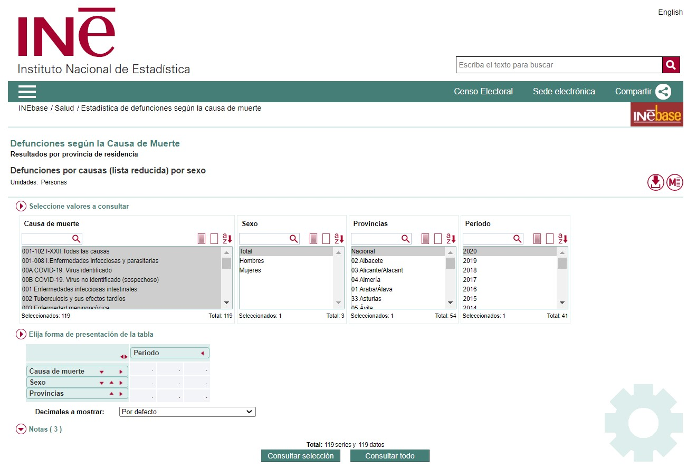
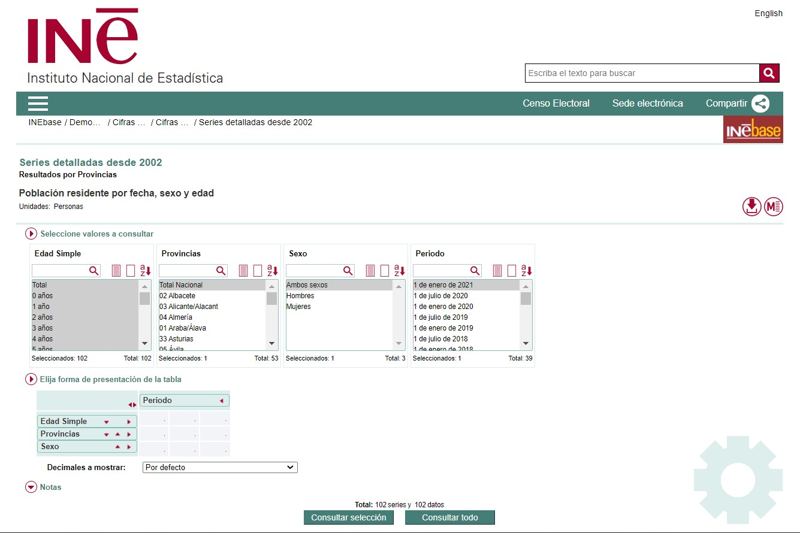
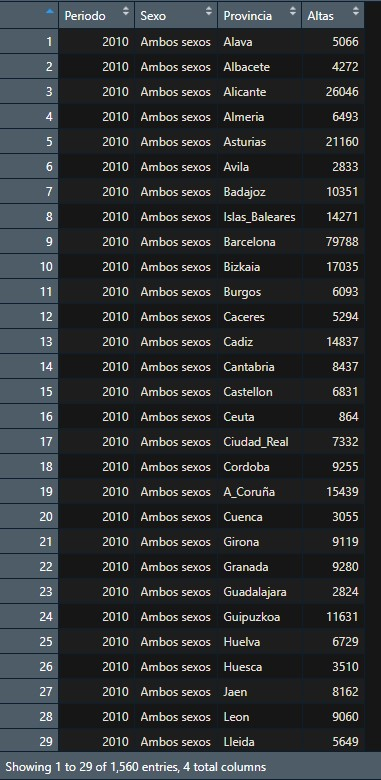
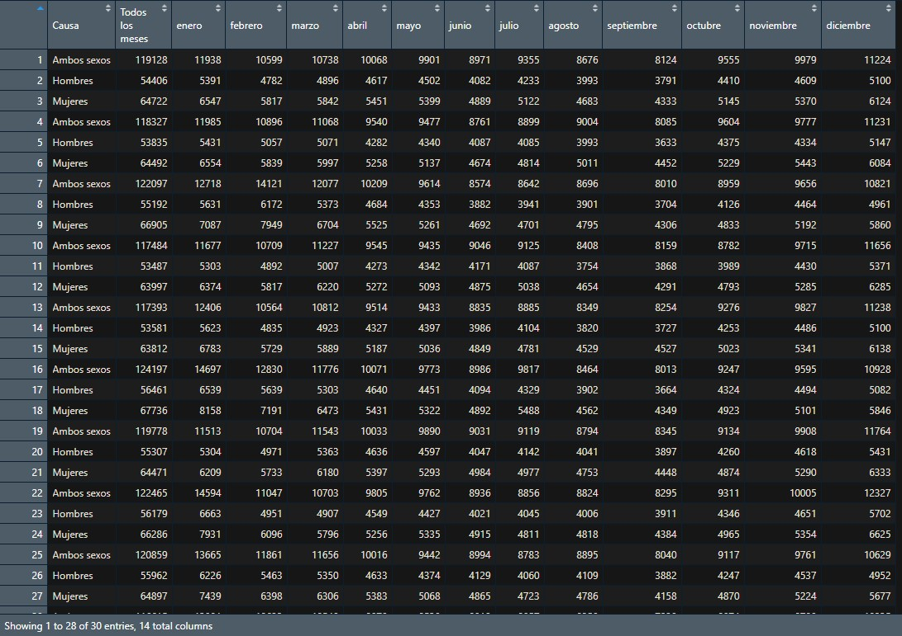
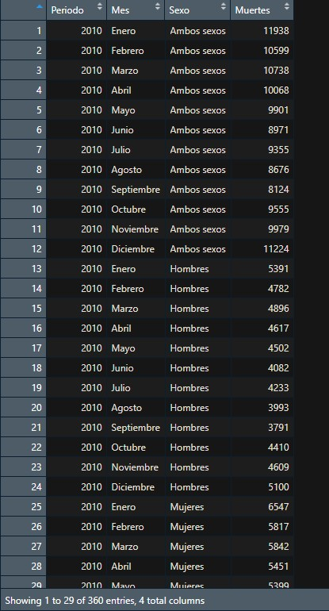
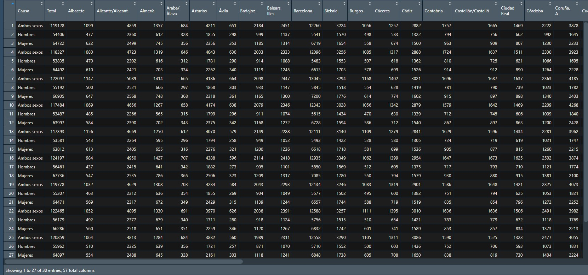
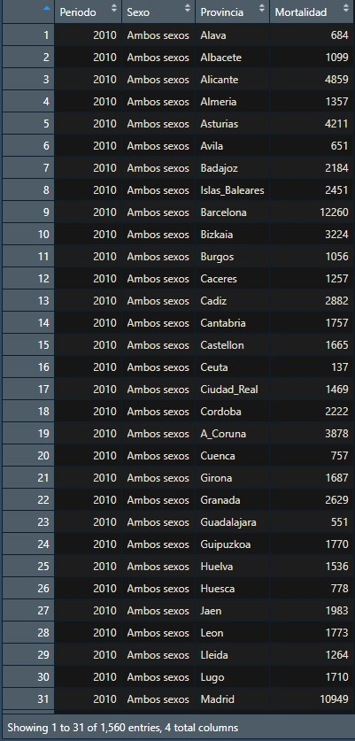
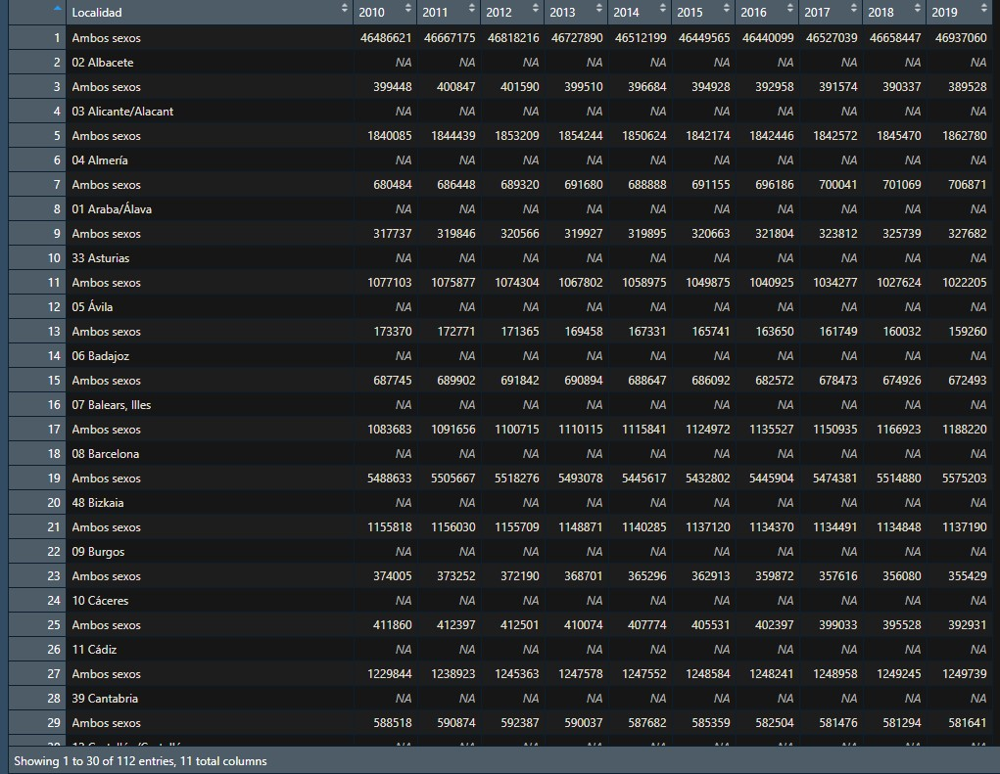
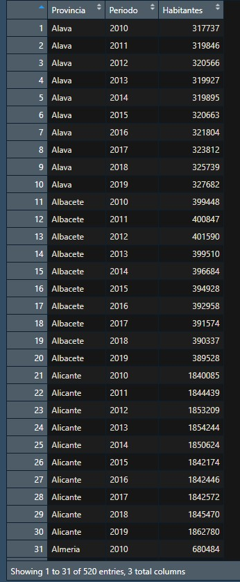

## {data-background=https://vinilosametros.com/wp-content/uploads/2018/04/color-azul-claro-2-510x509.jpg data-background-size=cover}
<center>
<font size="30">
<span style="color:black">
**INTRODUCCIÓN**

{width=600px}
</span>
</font>
</center>

## 
<span style="color:black">
<center>
<font size="6">

**¿POR QUÉ ESTE TEMA?**

</font>
</center> 

<div style="text-align: justify"> 

El proyecto realizado estudia la posible relación e influencia del cambio climático sobre la incidencia y mortalidad de enfermedades cardiovasculares.

Se ha escogido este tema debido a que estamos ante los datos más extremos de concentraciones de gases de efecto invernadero de la historia, aumentando el calor terrestre, por lo que podría desencadenar el aumento de riesgo de muerte para aquellas personas que padecen enfermedades cardiovasculares.

</div>
</span>
<center>
{width=200px}
</center>

## 
<span style="color:black">
<center>
<font size="6">

**CAMBIO CLIMÁTICO**

</font>
</center>

<div style="text-align: justify"> 

<span style="color:gray">
_¿Qué es?_
</span>

Los cambios a largo plazo de las temperaturas y los patrones climáticos como consecuencia de causas naturales y sobre todo humanas, como la quema de combustibles fósiles.


Esta quema de combustibles genera la emisión de gases de efecto invernadero que actúan elevando la temperatura terrestre. La mayor parte de estos gases está compuesta por dióxido de carbono y de metano.

</div>
</span>
<center>

{width=300px}
## 
<span style="color:black">
<center>
<font size="6">


</font>
</center>

<div style="text-align: justify"> 

<span style="color:gray">
_Causas_
</span>

- Naturales
  - Cambios de parámetros orbitales
  - Variaciones de la radiación solar
  - Deriva continental
  - Procesos bióticos
  - ...
  

</div>
</span>
<center>

{width=370px}
</center>

## 
<span style="color:black">
<center>
<font size="6">


</font>
</center>

<div style="text-align: justify"> 

<span style="color:gray">

</span>

- Humanas
  - Quema de combustibles fósiles
  - Transporte
  - Deforestación
  - Ganadería
  - ...

</div>
</span>
<center> 
  
{width=300px}            {width=310px}
</center> 


##
<span style="color:black">
<center>
<font size="6">

</font>
</center>

<div style="text-align: justify"> 

<span style="color:gray">

_Consecuencias_
</span>

- Deshielo y aumento del nivel del mar. 
- Condiciones metereológicas extremas que provocan inundaciones y deterioro de la calidad del agua.
- Olas de calor y sequías.
- Pérdidas económicas.
- Extinción y desplazamiento de especies a otros hábitats. 
- Aumenta el riesgo de muerte como consecuencia de temperaturas elevadas.

</div>
</span>

<center>
{width=250px}
</center>


## 
<span style="color:black">
<center>
<font size="6">

**ENFERMEDADES CARDIOVASCULARES**

</font>
</center>

<div style="text-align: justify"> 

<span style="color:gray">
_¿Qué son?_
</span>

Son aquellas relacionadas con el corazón o vasos sanguíneos. Se incluyen transtornos de los vasos sanguíneos, problemas en el ritmo cardíaco, defectos cardíacos, infecciones de corazón...

Este tipo de transtornos **causan el mayor número de muertes** en el mundo (según la [OMS](https://www.who.int/es/news-room/fact-sheets/detail/the-top-10-causes-of-death))

</div>
</span>

<center>
{width=350px}
</center>


##
<span style="color:black">
<center>
<font size="6">


</font>
</center>

<div style="text-align: justify"> 

<span style="color:gray">
_Síntomas_
</span>

- Dolor en el pecho. 
- Falta de aire. 
- Taquicardia o bradicardia
- Aturdimiento
- Mareos
- Fatiga

</div>
</span>

<center>
{width=300px}
</center>


##
<span style="color:black">
<center>
<font size="6">


</font>
</center>

<div style="text-align: justify"> 

<span style="color:gray">

_Causas_
</span>

- Infecciones
- Tabaquismo
- Hábitos de vida insanos
- Diabetes
- Abuso de drogas o bebidas alcohólicas
- Enfermedades congénitas

</div>
</span>

<center>
{width=250}
</center>

##
<span style="color:black">
<center>
<font size="6">


**RELACIÓN ENTRE AMBOS CONCEPTOS**

</font>
</center>

<div style="text-align: justify"> 

El aumento de la temperatura, el estrés ambiental y las variaciones en la presión atmosférica pueden afectar a factores fisiológicos como la presión arterial o la temperatura corporal. 

De igual manera el descenso de la temperatura puede influir en la viscosidad sanguínea y la frecuencia cardíaca. 

Por ello, cambios extremos e inusuales en los factores ambientales pudieran estar relacionados con un aumento de la incidencia y mortalidad de las ECV.

<center>
{width=300px}
</center>

</div>
</span>

##
<span style="color:black">
<center>
<font size="6">


</font>
</center>

<span style="color:gray">
_Otros estudios_
</span>

<div style="text-align: justify"> 

[1] [Peters, A., Schneider, A. Cardiovascular risks of climate change. Nature Reviews Cardiology 18, 1–2 (2021).](https://rdcu.be/cAYF8)

[2] [De Blois J, Kjellstrom T, Agewall S, Ezekowitz J, A, Armstrong P, W, Atar D: The Effects of Climate Change on Cardiac Health. Cardiology 2015](https://doi.org/10.1159/000398787)

[3] [Cheng X, Su H. Effects of climatic temperature stress on cardiovascular diseases. European Journal of Internal Medicine. 2010 Jun](https://doi.org/10.1016/j.ejim.2010.03.001)

[4] [Wang X, Cao Y, Hong D, Zheng D, Richtering S, Anderson C, Robinson T, Hackett ML. Ambient Temperature and Stroke Occurrence: A Systematic Review and Meta-Analysis. Int J Environ Res Public Health. 2016 Jul 12](https://doi.org/10.3390/ijerph13070698)

</div>
</span>

## {data-background=https://vinilosametros.com/wp-content/uploads/2018/04/color-azul-claro-2-510x509.jpg data-background-size=cover}
<center>
<font size="30">
<span style="color:black">

**OBJETIVOS**

{width=600px}
</span>
</font>
</center>

## 
<span style="color:black">
<center>
<font size="6">

**OBJETIVO GENERAL**

</font>
</center>

<div style="text-align: justify"> 

Tratar de encontrar correlación entre el cambio climático y una mayor incidencia y mortalidad de las enfermedades cardiovasculares en España en entre los años 2010 y 2019.

</div>
</span>


## 
<span style="color:black">
<center>
<font size="6">

**OBJETIVO ESPECÍFICO 1**

</font>
</center>

<div style="text-align: justify"> 

Estudiar las variables meteorológicas mensuales (temperatura, presión atmosférica e insolación diaria) de todas las provincias españolas desde 2010 hasta 2019, con el fin de determinar qué meses y provincias fueron los más adversos.

</div>
</span>


## 
<span style="color:black">
<center>
<font size="6">

**OBJETIVO ESPECÍFICO 2**

</font>
</center>

<div style="text-align: justify"> 

Una vez conocidas las provincias con climatología más adversa para cada año del periodo 2010-2019, comprobar si la morbilidad hospitalaria y la mortalidad por ECV fue significativamente mayor en dichas provincias con respecto a las climatológicamente normales.

</div>
</span>

## 
<span style="color:black">
<center>
<font size="6">

**OBJETIVO ESPECÍFICO 3**

</font>
</center>

<div style="text-align: justify"> 

Una vez conocidos qué meses y de qué año tuvieron una climatología más extrema en todo el territorio nacional, comprobar si la mortalidad por ECV fue significaticamente mayor esos meses en comparación con los demás meses.

</div>
</span>

## {data-background=https://vinilosametros.com/wp-content/uploads/2018/04/color-azul-claro-2-510x509.jpg data-background-size=cover}
<center>
<font size="30">
<span style="color:black">

**METODOLOGÍAS**

{width=600px}
</span>
</font>
</center>

## 
<span style="color:black">
<center>
<font size="6">

</font>
</center>

<span style="color:gray">
_Objetivo 1_
</span>

<div style="text-align: justify"> 

- Crear un archivo .csv que contenga las URL a los archivos con la información meterológica mensual por provincias desde 2010 hasta 2019.

- Crear los archivos correspondientes a cada provincia empleando R, obteniendo 52 dataframes (uno por provincia) que contengan toda la información meteorológica desde 2010 a 2019.
</div>
</span>

<center>

</center>

## 
<span style="color:black">
<center>
<font size="6">


</font>
</center>

<span style="color:gray">

</span>

<div style="text-align: justify"> 

- Filtrar cada dataframe para que únicamente contenga la información de cada año y mes referente a: temperatura media, temperatura media de las máximas, temperatura media de las mínimas, presión media, presión máxima absoluta, presión mínima absoluta, media de insolación y porcentaje medio mensual de la insolación diaria frente a la insolación teórica.

</div>
</span>

## 
<span style="color:black">
<center>
<font size="6">


</font>
</center>

<span style="color:gray">

</span>

<div style="text-align: justify"> 

- Comparar las variables meteorológicas de una misma provincia entre los diferentes meses y años y seleccionar los valores más extremos para cada variable meteorológica, almacenando en un vector aquellos meses y años con más de 2 factores extremos. Repetir dicho proceso con todas las provincias, de manera que se obtengan 52 vectores (como máximo) que contengan los meses más adversos correspondientes a cada provincia.

</div>
</span>

<center>
{width=300px}
</center>

## 
<span style="color:black">
<center>
<font size="6">

</font>
</center>

<span style="color:gray">
_Objetivo 2_
</span>

<div style="text-align: justify"> 

- Descargar todos los archivos en formato .json que contienen la información relativa a morbilidad hospitalaria y causas de defunción desde 2010 a 2019 a través de la página INEBase.

- Combinar dichos archivos mediante R para obtener 52 dataframes (uno por provincia) que contenga toda la información referente a la morbilidad hospitalaria y causas de defunción anual desde 2010 a 2019.

</div>
</span>

<center>
{width=300px}
</center>


## 
<span style="color:black">
<center>
<font size="6">


</font>
</center>

<span style="color:gray">

</span>

<div style="text-align: justify"> 

- Filtrar los dataframes para que únicamente contengan la información referente a morbilidad hospitalaria por Enfermedades del aparato circulatorio (I00-I99) y causas de defunción debido a Enfermedades del sistema circulatorio (053-061) clasificado por provincias y año.

- Comprobar si hay alguna provincia que posea 3 meses en un mismo año con meteorología adversa, y contrastar la mortalidad y morbilidad hospitalaria para ECV en esa provincia y ese año con los datos normales.

</div>
</span>

## 
<span style="color:black">
<center>
<font size="6">


</font>
</center>

<span style="color:gray">
_Objetivo 3_
</span>

<div style="text-align: justify"> 

- Combinar los archivos de causas de defunción mensual a nivel nacional obteniendo 10 dataframes (uno por año desde 2010 a 2019).

- Filtrar dichos dataframes para que únicamente contengan la información referente al número de muertes por Enfermedades del sistema circulatorio (053-061) en cada mes de dicho año.

</div>
</span>

<center>
{width=300px}
</center>
## 
<span style="color:black">
<center>
<font size="6">


</font>
</center>

<span style="color:gray">

</span>

<div style="text-align: justify"> 

- Comprobar si hay algún mes de algún año que aparezca como adverso en más de 20 provincias, y contrastar la mortalidad por Enfermedades del sistema circulatorio en ese mes con el resto de datos normales.

- Graficar los resultados obtenidos en todos los análisis.

</div>
</span>

<center>
{width=400px}
</center>


## {data-background=https://vinilosametros.com/wp-content/uploads/2018/04/color-azul-claro-2-510x509.jpg data-background-size=cover}
<center>
<font size="30">
<span style="color:black">

**DESARROLLO DEL PROYECTO**

</font>
</center> 

<div style="text-align: justify"> 
### **1. Carga de los datos**

En el proyecto desarrollado se va a tratar de vincular el cambio climático con las enfermedades cardiovasculares, para ello se emplean 5 fuentes de datos distintas:

-	Datos meteorológicos mensuales a nivel provincial
-	Datos anuales de morbilidad a nivel provincial 
-	Datos anuales de mortalidad a nivel provincial
-	Datos mensuales de mortalidad a nivel nacional
-	Datos anuales de número de población a nivel provincial

Se va a explicar desde qué fuente y cómo se obtuvieron cada uno de ellos.

#### _1.1. Datos metereológicos_

En un principio se obtuvieron desde la plataforma de Open Data del AEMET, generando para ello un fichero .csv con todos los enlaces a cada conjunto de datos:


      

Sin embargo surgió uno de los primeros problemas: los enlaces empleados tenían una cierta caducidad y no eran válidos trascurridos 5 días. Por ello nos vimos obligados a cambiar la forma de acceder a dichos datos. Se descubrió un paquete de R denominado climaemet que incorpora varias funciones, permitiendo acceder de forma directa a los datos meteorológicos desde R.

Para ello se empleó la función climaemet::aemet_monthly_period(station, start, end) que permite acceder a los datos mensuales de cada provincia, pasando como parámetro station el nombre de la estación climatológica de interés y como parámetros start y end los años de inicio y fin de la búsqueda.

El objetivo era crear 52 dataframes, uno para cada provincia. El nombre de estos dataframes esta compuesto por el nombre de la provincia + la palabra ‘Meteo’. Para emplear un formato estándar de nombres de provincias se declararon 2 vectores:


```r
Provincias <- c("Alava","Albacete","Alicante","Almeria","Asturias","Avila","Badajoz","Islas_Baleares","Barcelona","Bizkaia","Burgos","Caceres","Cadiz","Cantabria","Castellon","Ceuta","Ciudad_Real","Cordoba","A_Coruna","Cuenca","Girona","Granada","Guadalajara","Guipuzkoa","Huelva","Huesca","Jaen","Leon","Lleida","Lugo","Madrid","Malaga","Melilla","Murcia","Navarra","Ourense","Palencia","Las_Palmas","Pontevedra","La_Rioja","Salamanca","Tenerife","Segovia","Sevilla","Soria","Tarragona","Teruel","Toledo","Valencia","Valladolid","Zamora","Zaragoza")

Estaciones <- c("9091O","8175","8019","6325O","1212E","2444","4452","B954","0200E","1082","2331","3469A","5960","1109","8500A","5000C","4121","5402","1387","8096","0367","5530E","3168D","1014A","4642E","9898","5270B","2661","9771C","1505","3129","6155A","6000A","7178I","9263D","1690A","2374X","C029O","1495","9170","2867","C447A","2465","5783","2030","9981A","9381I","3260B","8416","2422","2614","9434")
```

De esta manera se crearon los 52 dataframes empleando recursividad:


```r
for (i in 1:length(Provincias)){
  Nam <- paste(Provincias[i], "Meteo", sep="")
  Objeto <- aemet_monthly_period(station = Estaciones[i], start = 2010, end = 2019)
  assign(Nam, Objeto)
}
```


     
     
Una vez creados estos dataframes, se tuvieron que realizar varias correcciones debido a que ciertas estaciones seleccionadas (la de Guadalajara, Málaga, Palencia, Soria y Valladolid) presentaban años incompletos o de los cuales directamente no existía información (obligándonos a seleccionar otra estación de la misma provincia e introducir la información restante de forma manual).
Un ejemplo de cómo se introdujo esta información:


```r
MalagaMeteo <- bind_rows(MalagaMeteo, aemet_monthly_clim(station = "6084X", year = 2015)
```

Por último, estos dataframes modificados por falta de datos debieron ser reordenados por fecha para facilitar su posterior trabajo. El problema es que el formato de fecha que presenta AEMET es 2010-1 por ejemplo, por lo que al ordenar por fecha colocaba antes el mes 2010-12 que 2010-2. Por ello se hizo necesario declarar una función que nos permitiera reordenar los dataframes:


```r
Reorder <- function(provincia){
  #recorre todos los elementos de la columna fecha de la provincia pasada como parámetro
  for (i in 1:length(provincia$fecha)){
    #comprueba si el tamaño del elemento actual de la columna fecha tiene menos de 7 caracteres
    if(nchar(provincia$fecha[i])<7){
      #en caso de que así sea, corta la cadena donde debiera ir el 0, lo introduce y pega la parte de después del 0
      provincia$fecha[i] <- paste(str_sub(provincia$fecha[i], start = 1L, end = 5L), "0", str_sub(provincia$fecha[i], start = -1L, end=-1L), sep = "")
    }
  }
  #por último devuelve la provincia pasada, pero ahora ordenada por fecha (donde ya sí que se puede ordenar correctamente por fecha)
  return(arrange(provincia, fecha))
}
```

Posteriormente aplicaríamos esta función a las provincias modificadas (GuadalajaraMeteo, MalagaMeteo, SoriaMeteo, PalenciaMeteo, ValladolidMeteo).

#### _1.2 Datos de Morbilidad_
Estos datos se obtuvieron desde la página del INE, en el apartado Salud / Encuesta de morbilidad hospitalaria:


Desde donde se descargaron los datos en formato .xlsx. Estos archivos de Excel se almacenaron en la carpeta INPUT, y se importaron al archivo .R empleando el siguiente código:


```r
DFMorbilidad <- data.frame()
for (i in dir_ls(path = "INPUT", regexp="morbilidad")){
  temporal <- read_excel(path = i, sheet = "tabla-0", skip = 6, col_types = c("text",rep("numeric",64))) 
  DFMorbilidad <- bind_rows(DFMorbilidad, temporal)
```

Como se puede comprobar se almacenaron en un objeto denominado DFMorbilidad

#### _1.3 Datos de Mortalidad mensual_
También se obtuvieron desde la base de datos del INE, en el apartado INEbase / Salud / Estadística de defunciones según la causa de muerte / Resultados nacionales / Defunciones por causas (lista reducida), sexo y mes de fallecimiento. Un ejemplo de este acceso para el año 2010 es:


     
Desde aquí se descargaron los datos en formato .xlsx a la carpeta INPUT. La carga de datos al archivo .R se realizó empleando el siguiente fragmento de código:


```r
DFMort_Mens <- data.frame()
for (i in dir_ls(path = "INPUT", regexp="Mort_nacion")){
  temporal <- read_excel(path = i, sheet = "tabla-0", skip = 6) 
  DFMort_Mens <- bind_rows(DFMort_Mens, temporal)
}
```

Donde podemos comprobar que se almacenaron en un objeto denominado DFMort_Mens.

#### _1.4 Datos de mortalidad provincial_

De nuevo acudimos al INE, al apartado INEbase / Salud / Estadística de defunciones según la causa de muerte / Resultados por provincia de residencia/ Defunciones por causas (lista reducida) por sexo. Ejemplo de ello:


     
Donde se descargaron los archivos en formato .xlsx en la carpeta INPUT. Desde ahí se cargaron de nuevo al fichero. R mediante el siguiente código:

```r
DFMort_Prov <- data.frame()
for (i in dir_ls(path = "INPUT", regexp="mort_prov")){
  temporal <- read_excel(path = i, sheet = "tabla-0", skip = 6) 
  DFMort_Prov <- bind_rows(DFMort_Prov, temporal)
}
```
Observamos que se ha almacenado en un objeto denominado DFMort_Prov

#### _1.5 Datos de poblacion_

El último tipo de datos, datos acerca de la población de cada provincia, se obtuvieron de nuevo desde el INE, en el apartado INEbase / Demografía y población / Cifras de Población y Censos demográficos /Cifras de población, como se muestra a continuación:


     
Que nuevamente fueron descargados en la carpeta INPUT en formato .xlsx. Para su importación en el .R se empleó el siguiente código:


```r
DFPoblacion <- read_excel("C:/Users/samue/Documents/UBU/3er curso/FDB y Web Semántica/Cambio_climatico_y_ECV/INPUT/Poblacion_prov.xlsx", 
                          skip = 6)
```

Como podemos observar se almacenaron en un objeto denominado DFPoblacion.
Una vez importados todos los datos, haciendo un repaso de los objetos hasta ahora obtenidos (y con los que vamos a trabajar de aquí en adelante) encontramos: los 52 dataframe ProvinciaMeteo con datos meteorológicos, DFMorbilidad con información de la morbilidad, DFMort_Mens con el número mensual de muertes a nivel nacional, DFMort_Prov con el número anual de muertes por provincia y DFPoblacion con el número de habitantes por provincia y año.


### **2. REFINAMIENTO DE LOS DATOS**

Hasta el momento hemos logrado importar los datos en nuestro archivo de R, pero son datos brutos, difíciles de manejar, poco inteligibles y con mucha información que nos sobra. A continuación vamos a explicar el proceso de refinamiento de dichos datos.

#### _2.1 Datos metereológicos_

De toda la información que contienen nuestros dataframes ProvinciaMeteo, solo nos interesan las filas que contienen información mensual, aquellas que contienen información anual nos sobran. De igual manera solo nos interesan las columnas que hacen referencia a las variables meteorológicas que vamos a estudiar: tm_max (temperatura media de las máximas), tm_min (temperatura media de las mínimas), q_max (presión media de las máximas), q_min (presión media de las mínimas), hr (humedad relativa) y p_sol (insolación real/insolación teórica en %). Además de estas tareas de eliminación, vamos a añadir 2 columnas nuevas a cada dataframe: una denominada Periodo con el año del dato y otra denominada Mes con el mes del dato, y posteriormente vamos a eliminar la columna `fecha` que viene por defecto en el dataframe. Por último vamos a convertir las columnas q_max y q_min a numérico (ya que por defecto vienen como carácter al incorporar en el valor del dato el día del mes en que se obtuvo ese valor).
Como vamos a querer aplicar todas estas modificaciones a 52 dataframes vamos a crear una función para ello, facilitándonos el trabajo posterior. Esta función es la siguiente:


```r
Mod_meteo <- function(prov){
  # Como vamos a emplear la función sobre una lista de nombres (y no con los objetos directamente), debemos emplear la función 'get()' que nos permita obtener el objeto al que referencia ese nombre
  Objeto <- get(prov)
  # Nos quedamos solo con las columnas de interés
  Objeto <- select(Objeto, c(`fecha`,`tm_max`,`tm_min`,`q_max`,`q_min`,`p_sol`,`hr`)) %>% 
    # Eliminamos las filas referentes a valores de medias anuales
    filter(.data = . , !`fecha` %in% c("2010-13","2011-13","2012-13","2013-13","2014-13","2015-13","2016-13","2017-13","2018-13","2019-13")) %>% 
    # Introducimos las columnas de Periodo y de Mes
    bind_cols(Periodo = rep(c(2010,2011,2012,2013,2014,2015,2016,2017,2018,2019), each=12), Mes = rep(c("Enero","Febrero","Marzo","Abril","Mayo","Junio","Julio","Agosto","Septiembre","Octubre","Noviembre","Diciembre"), 10)) %>% 
    # Colocamos estas columnas recién creadas como las 2 primeras y eliminamos la columna de fecha empleando el subset y el complementario de fecha (indicado como - `fecha`) 
    relocate(.,c(`Periodo`,`Mes`),.before = `fecha`) %>% 
    subset(select = -`fecha`)
  
  # Recorremos cada elemento de la columna q_max del dataframe respectivo y eliminamos las posiciones que contienen caracteres no numéricos.
  for (i in 1:length(Objeto$q_max)){
    Objeto$q_max[i] <- str_sub(string = Objeto$q_max[i], start = 1L, end = -5L)
    Objeto$q_min[i] <- str_sub(string = Objeto$q_min[i], start = 1L, end = -5L)
  }
  
  # Forzamos la conversión a numeric una vez eliminados los elementos del tipo character
  Objeto$q_max <- as.numeric(Objeto$q_max)
  Objeto$q_min <- as.numeric(Objeto$q_min)
  
  return(Objeto)
}
```

Una vez obtenida la función ya podemos aplicarla sobre cada dataframe de meteorología:


```r
for (i in 1:length(Provincias)){
  Nam <- paste(Provincias[i],"Meteo",sep = "")
  assign(Nam,Mod_meteo(Nam))
}
```

De esta manera hemos logrado modificar los datos de meteorología, dejándolos más legibles y entendibles. 


Las columnas Periodo y Mes son de tipo carácter y representan el año y mes al que corresponden los datos. Las columnas tm_max (temperatura media de las máximas), tm_min (temperatura media de las mínimas), q_max (presión media de las máximas), q_min (presión media de las mínimas), p_sol(porcentaje de insolación real frente a insolación teórica) y hr (humedad relativa) son de tipo numeric. Cada dataframe de meteorología posee 120 filas (12 meses*10 años) y 8 columnas.

#### _2.2 Datos de morbilidad_

En el refinamiento de estos datos se busca seleccionar las filas que contienen información únicamente sobre ECV (eliminando el resto de filas), eliminando también la columna CAUSA e introduciendo la columna Periodo que contiene los años de cada dato y la columna Sexo con el sexo de cada dato:


```r
DFMorbilidad <- filter(DFMorbilidad, CAUSA %in% c("390-459 VII ENFERMEDADES DEL SISTEMA CIRCULATORIO", "0900 ENFERMEDADES DEL APARATO CIRCULATORIO I00-I99")) %>% 
  bind_cols(Periodo = rep(c(2010,2011,2012,2013,2014,2015,2016,2017,2018,2019), each=3), Sexo = rep(c("Ambos sexos", "Hombres", "Mujeres"), 10)) %>% 
  subset(select = - CAUSA)
```

Posteriormente eliminar las columnas que hacen referencia a comunidades autónomas (seleccionando solo las que contienen información de provincias):


```r
DFMorbilidad <- DFMorbilidad[ ,order(names(DFMorbilidad))] %>% 
  relocate(.,`Araba/Álava`, .before = `Albacete`) %>% 
  relocate(., `Gipuzkoa`, .after = `Guadalajara`)

j <- 1
for (i in 1:length(DFMorbilidad)){
  if (!colnames(DFMorbilidad)[i] %in% c("Sexo","Periodo")){
    colnames(DFMorbilidad)[i] = Provincias[j]
    j <- j+1
  }
}
```

Por último vamos a recolocar las columnas periodo y sexo y a cambiar la tabla a formato 'longer' para que se adecúe más a nuestro tipo de datos de meteorología.


```r
DFMorbilidad <- relocate(DFMorbilidad,c(`Periodo`,`Sexo`),.before = `Alava`) %>% 
  pivot_longer(data = ., names_to = "Provincia", values_to = "Altas", cols= c(Alava:Zaragoza))
```


     
Este es el aspecto final del dataframe DFMorbilidad, donde la variable Periodo, Sexo y Provincia son de tipo carácter, y la columna Altas (que representa el número de altas hospitalarias por ECV para ese triplete de Periodo, Sexo, Provincia) es de tipo _numeric_.


#### _2.3 Datos de mortalidad nacional menusal_

Lo primero que vamos a realizar es determinar en qué posiciones, en qué filas, hay información sobre ECV:


```r
posiciones <- which(DFMort_Mens$Causa %in% c("053-061 IX.Enfermedades del sistema circulatorio"))
```

Una vez obtenidas estas posiciones, y empleando un dataframe auxiliar denominado temporal (que usaremos como pivote temporal) vamos a cargar las filas que contienen información sobre ECV en el dataframe temporal:


```r
for(i in posiciones){
  temporal <- bind_rows(temporal, DFMort_Mens[(i+1):(i+3), ])
}
```

Ahora tenemos un dataframe temporal con el siguiente aspecto:


     
Por lo que debemos modificarlo antes de almacenarlo en el ya definitivo DFMort_Mens. Las modificaciones necesarias son incorporar la columna Periodo que contiene el año del dato, recolocar esta columna y eliminamos la columna ‘Todos los meses’. Por último realizamos un pivot_longer() para dar el formato deseado a los datos y ponemos en mayúscula el nombre de los meses para facilitar futuros join:


```r
DFMort_Mens <- mutate(temporal, Periodo = rep(c(2010,2011,2012,2013,2014,2015,2016,2017,2018,2019), each=3)) %>% 
  mutate(Sexo = Causa) %>% 
  relocate(`Sexo`, .before = `Todos los meses`) %>% 
  relocate(`Periodo`, .before = `Sexo`) %>% 
  subset(select = -c(`Todos los meses`,`Causa`)) %>% 
  # Realizamos también un pivot_longer() para almacenar los datos en formato longer y ponemos en mayúsculas el nombre de los meses para facilitar posteriores join con otras tablas
  pivot_longer(names_to = "Mes", values_to = "Muertes", cols = c(enero:diciembre)) %>% 
  relocate(Mes, .before = `Sexo`) %>% 
  mutate(Mes = capitalize(Mes))
```

El resultado final es un dataframe DFMort_Mens como el siguiente:


     
Que posee 3 variables de tipo carácter: Periodo, Mes y Sexo. Y también posee una cuarta columna ‘Muertes’ que representa el número mensual de muertes para esa combinación de Periodo, Mes y Sexo.

#### _2.4 Datos de Mortalidad Provincial_

El primer paso en el tratamiento de estos datos es nombrar la primera columna del dataframe como Causa para facilitar su posterior manejo:


```r
names(DFMort_Prov)[1] <-"Causa"
```

Al igual que en el refinamiento de datos de mortalidad mensual, vamos a seleccionar las posiciones de las filas que contienen información referente a muertes por ECV y las almacenaremos en el vector posiciones:


```r
posiciones <- which(DFMort_Prov$Causa %in% c("053-061 IX.Enfermedades del sistema circulatorio"))
```

De manera idéntica al punto 2.3 vamos a emplear un dataframe pivote denominado temporal. En él vamos a cargar estas filas que nos son de interés:


```r
for(i in posiciones){
  temporal <- bind_rows(temporal, DFMort_Prov[(i+1):(i+3), ])
}
```

Posteriormente cargamos temporal en DFMort_Prov, quedándonos este dataframe con el siguiente aspecto:




Hay que modificar por tanto este dataframe para lograr llegar a la forma final, la forma inteligible y más útil. Para ello vamos a eliminar las 3 últimas columnas (contienen datos de extranjeros e información que no nos es útil) para posteriormente introducir la columna Periodo, la columna Sexo, y posteriormente ordenar las columnas para que el orden coincida con el del vector estándar Provincias. Tras realizar pivot_longer(), introducimos una columna con los elementos del vector Provincias (logrando así estandarizar los nombres de las provincias de las filas). Y ya tendríamos el dataframe listo. El código es el siguiente:


```r
DFMort_Prov <- DFMort_Prov[ ,1:(length(DFMort_Prov)-3)] %>% 
  mutate(Sexo = Causa, Periodo = rep(c(2010,2011,2012,2013,2014,2015,2016,2017,2018,2019), each=3)) %>% 
  relocate(Periodo, .before = Causa) %>% 
  relocate(Sexo, .before = Causa) %>% 
  subset(select = -c(Causa, Total)) %>% 
  relocate(.,`Araba/Álava`, .before = `Albacete`) %>% 
  relocate(., `Gipuzkoa`, .after = `Guadalajara`) %>%
  relocate(., `Ceuta`, .before = `Ciudad Real`) %>% 
  relocate(., Melilla, .before = `Murcia`) %>% 
  pivot_longer(names_to = "temporal", values_to = "Mortalidad", cols = c(`Araba/Álava`:`Zaragoza`)) %>% 
  mutate(., `Provincia` = rep(Provincias, 30)) %>% 
  relocate(Provincia, .before = temporal) %>% 
  subset(select = -temporal)
```

Siendo el resultado final del dataframe DFMort_Prov:


     
Donde la columna Periodo, Sexo y Provincia son de tipo character y la columna Mortalidad es de tipo numeric y representa el número de muertes por provincia, sexo y periodo.


#### _2.5 Datos de población_

Lo primero que vamos a realizar es nombrar la primera columna como “Localidad” para facilitar su manejo. Posteriormente vamos a seleccionar las columnas que contienen información poblacional recogida el 1 de enero (hay también columnas del 1 de julio). Del dataframe restante vamos a escoger aquellas columnas que se corresponden con el periodo de tiempo que nos interesa (2010-2019) y eliminar las filas con datos nacionales (quedándonos exclusivamente con datos provinciales). Por último renombramos las columnas para posteriores join con otras tablas:


```r
names(DFPoblacion)[1] <- "Localidad"
DFPoblacion <- select(DFPoblacion, starts_with(c("Localidad","1 de enero"))) %>% 
  select(. , ends_with(c("Localidad","2010","2011","2012","2013","2014","2015","2016","2017","2018","2019"))) %>%
  filter(!Localidad %in% c("Total","Total Nacional"))
names(DFPoblacion) <- c("Localidad","2010","2011","2012","2013","2014","2015","2016","2017", "2018","2019")
```

De esta manera hemos conseguido un dataframe como el siguiente:



Que aún dista de lo que deseamos. El primer paso es sustituir el valor ‘Ambos sexos’ por el de la provincia correspondiente, y después eliminar las filas de NA:


```r
i <- 2
while(i<length(DFPoblacion$Localidad)){
  nombre <- DFPoblacion$Localidad[i]
  DFPoblacion$Localidad[i+1] <- nombre
  i <- i+2
}

DFPoblacion <- drop_na(DFPoblacion)
```

A continuación eliminamos el número previo presente en el valor de la columna Localidad y hacemos un par de cambios de nombre de provincia (para poder ordenarlos alfabéticamente).


```r
for (i in 1:length(DFPoblacion$Localidad)){
  DFPoblacion$Localidad[i] <- str_sub(DFPoblacion$Localidad[i], start = 4)
}

DFPoblacion$Localidad[which(DFPoblacion$Localidad %in% c("Araba/Álava"))] <- "Alava"
DFPoblacion$Localidad[which(DFPoblacion$Localidad %in% c("Gipuzkoa"))] <- "Guipuzkoa"

DFPoblacion <- arrange(DFPoblacion, Localidad)
```

Una vez ya ordenado alfabéticamente introducimos la nueva columna Provincia que contiene el nombre estandarizado de cada provincia empleando el vector inicial Provincias. Finalmente realizamos un pivot_longer() para que los datos puedan relacionarse mejor con otras tablas. El dataframe DFPoblacion obtenido es el siguiente:



Que posee 520 filas (52 provincias * 10 años) y 3 columnas: 2 de ellas caracteres (Provincia y Periodo) y una de tipo numeric (Habitantes) que representa el número de habitantes en esa provincia ese año.
